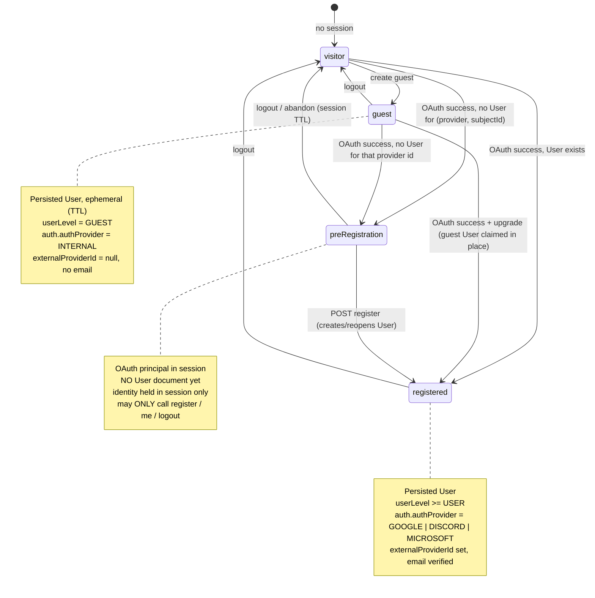
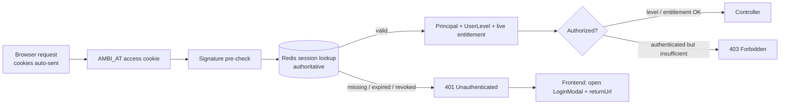

# `auth` package

Identity and authentication for Ambi. This README is the authoritative
**design + security-invariants** doc for the auth rewrite. It is grounded in the
model classes that exist today and marks everything else **planned**, so the
security layer can be built against a fixed checklist.

> **Status: rewrite in progress.** Present in this package: `AuthInfo`,
> `enums/AuthProvider`. The `User` document lives in [`../user`](../user),
> entitlement in [`../billing`](../billing), org roles in [`../org`](../org).
> The security layer (filter chain, token/session service, OAuth success
> handler, auth controller) is **not yet wired** — the flows and invariants
> below are the contract that work must satisfy.

---

## What lives where

| Concern                         | Type                         | Package       |
| ------------------------------- | ---------------------------- | ------------- |
| Provider + external subject id  | `AuthInfo`, `AuthProvider`   | `auth` (here) |
| Account document, account class | `User`, `UserLevel`          | `user`        |
| Entitlement / subscription      | `Membership`, `BillingState` | `billing`     |
| Org-scoped roles                | `OrgMembership`, `OrgRole`   | `org`         |

`AuthInfo` is provider-agnostic on purpose:

```java
authProvider        // GOOGLE | DISCORD | MICROSOFT | INTERNAL
externalProviderId  // the provider's subject id; null for INTERNAL (guests)
```

The identity key for an OAuth account is the pair **`(authProvider,
externalProviderId)`** — there is no `googleId` field. Any lookup, de-dup, or
"reopen closed account" logic keys on that pair, **not** on email.

---

## Token & session model

Auth is **cookie + Redis session**, with JWT used as the access-token _format_.

- **Both tokens are HttpOnly + Secure cookies.** JavaScript never reads them, so
  XSS cannot exfiltrate them. The cost is that cookies are sent automatically,
  which puts **CSRF on the table** — see Invariant 3.
- **Redis is the source of truth.** Every authenticated request is validated
  against Redis, not by JWT signature alone. A token whose session is absent,
  expired, or revoked in Redis is rejected **even if its signature is valid**.
  The signature is a cheap pre-check; Redis decides. This is a deliberate trade
  of stateless scalability for **instant revocation** (logout / ban take effect
  on the next request). Practically, the access JWT is a Redis-backed session
  handle — treat it as such; do not assume statelessness.
- **Access token**: short-lived. **Refresh token**: longer-lived, validated
  against Redis on `/refresh`.
- **Sliding 30-minute idle window.** While the user is active the frontend polls
  `/refresh` to mint a new access token and slide the Redis TTL. After ~30 min
  of inactivity the session expires and the user must sign in again.
- **"Stay logged in"** issues a _persistent_ refresh token (long TTL, survives
  browser close) instead of a session-scoped one. This **requires refresh-token
  rotation with reuse detection** (Invariant 6).

| Token   | Cookie    | Lifetime                 | Backed by Redis? |
| ------- | --------- | ------------------------ | ---------------- |
| access  | `AMBI_AT` | short (~15 min)          | yes (validated)  |
| refresh | `AMBI_RT` | 30 min idle / persistent | yes (rotated)    |

_(Cookie names / exact TTLs are placeholders — confirm on the session config.)_

---

## Identity model — four states

Every request resolves to exactly one of these. Note **`preRegistration`**: a
principal that authenticated with a provider but has **no `User` document yet**.
It is a first-class state, not an accident between `visitor` and `registered`.



### How each state maps to data

| State             | `User` doc? | `userLevel`             | `auth.authProvider`  | `externalProviderId` | email          |
| ----------------- | ----------- | ----------------------- | -------------------- | -------------------- | -------------- |
| `visitor`         | no          | —                       | —                    | —                    | —              |
| `guest`           | yes (TTL)   | `GUEST`                 | `INTERNAL`           | `null`               | none           |
| `preRegistration` | **no**      | — (no doc)              | from OAuth (session) | from OAuth (session) | from OAuth     |
| `registered`      | yes         | `USER` / `PREMIUM_USER` | provider             | set                  | set + verified |

`preRegistration` holds identity in the **session only**. `register` reads
`(provider, subjectId, email)` from the session principal — never from
request/query params (Invariant 5).

---

## Access model

Two independent axes; do not conflate them.

**1. Account class — `UserLevel` (weight-based).** Access is a numeric `>=`
comparison via `UserLevel.hasAccessTo`:

```
GUEST(10) < USER(20) < PREMIUM_USER(30) < ADMIN(100) < SUPER_ADMIN(200)
```

Per-route minimums (initial plan; expand later):

| Route class                     | Minimum level                                               |
| ------------------------------- | ----------------------------------------------------------- |
| Regular app routes, decks, etc. | `USER` (20)                                                 |
| Join / view a game session      | `GUEST` (10) **iff the session allows guests**, else `USER` |
| Premium features                | `USER` (20) **+ live entitlement** (see below)              |
| Moderation / admin              | `ADMIN` (100) / `SUPER_ADMIN` (200)                         |

The backend is the source of truth for these checks. The frontend **also** gates
via TanStack routes for UX (no flashing protected pages), but a frontend gate is
never the enforcement boundary.

**2. Entitlement — `Membership.BillingState`.** A premium _feature_ gate checks
live billing status, not just `userLevel`:

> **Lapsed entitlement collapses to FREE.** Any `MembershipStatus` other than
> `ACTIVE` / `TRIALING` (i.e. `PAST_DUE`, `CANCELED`, `EXPIRED`, `NONE`) is
> treated as `FREE` regardless of the stored `tier`. Because every request is
> already validated against Redis, evaluate this **live** (Invariant 7).

**Org roles** (`OrgMembership` → `OrgRole`: OWNER > ADMIN > USER) are a third,
resource-scoped axis in `User.orgRoles`.

---

## Request authorization path



**401 vs 403 are distinct and must stay distinct** (Invariant 8): 401 = no valid
session → frontend opens the login modal and stashes the current path as
`returnUrl`; 403 = authenticated but not allowed → show an upgrade / permission
UI, **do not** open the login modal.

---

## Security invariants

Non-negotiable for the rewrite. Each is a property the security layer must hold;
tests should pin them.

### 1. Guest upgrade derives the guest from the session, never from input

When a guest upgrades via OAuth, the guest `User` to claim is identified by the
**currently authenticated guest principal** in the session — **not** by a
`guestId` query/body param. There is no `?guestId=` parameter. This removes the
IDOR/account-takeover class entirely and keeps the id out of URLs. The upgrade is
valid only when the session's own principal is a guest.

### 2. `returnUrl` is validated as a same-origin relative path

`returnUrl` is attacker-controlled and is used both as a redirect target and as
`window.location`. Validate **before** stashing and **before** redirecting. A
`startsWith("/")` check is **not** enough. Accept only if **all** hold, else fall
back to `/`:

- starts with a single `/`, and the **second** char is neither `/` nor `\`
  (rejects `//evil.tld` protocol-relative and `/\evil.tld` backslash tricks);
- parses with **no scheme and no host** (rejects `javascript:`, `data:`, …);
- ideally matches a known route allowlist.

Implement once as a shared, unit-tested utility.

### 3. CSRF protection on every mutating endpoint

Tokens live in cookies and are sent automatically, so CSRF applies:

- Enable Spring Security CSRF with a **double-submit cookie**
  (`CookieCsrfTokenRepository.withHttpOnlyFalse()`); the SPA echoes the token in
  `X-XSRF-TOKEN` on every state-changing request, including `/refresh`.
- `SameSite=Lax` is **defense-in-depth, not the whole defense** — it doesn't
  cover state-changing GETs or every same-site case. Keep the CSRF token.
- **No state-mutating GETs.** Carry `returnUrl` through the OAuth `state` /
  authorization request rather than writing session state on a GET.
- Exempt only the framework OAuth endpoints (`/oauth2/**`, `/login/oauth2/**`).

### 4. Rotate the session id at every privilege boundary

On `visitor → guest`, `guest|visitor → registered`, and `preRegistration →
registered`, issue a **fresh session id / token** and invalidate the old one.
Hand-writing the security context bypasses the framework's fixation protection;
if you build the context manually, rotate manually. Prevents session fixation
across the privilege jump.

### 5. Registration identity comes from the session principal only

`POST register` takes only user-chosen fields (username, newsletter, …).
`(provider, externalProviderId, email)` are read from the authenticated OAuth
principal in the session. Any `?provider=&email=…` on the registration page is
**display prefill only** and is never trusted for identity — otherwise it is
register-as-anyone.

### 6. Refresh-token rotation with reuse detection

On every `/refresh`, mint a new refresh token, invalidate the old one in Redis,
and remember its lineage. If an **already-used** refresh token is replayed,
revoke the whole token family (a replay means it leaked). Mandatory for the
persistent "stay logged in" cookie.

### 7. Entitlement is resolved live

Premium/tier access is evaluated from the current `BillingState` at decision
time, not from a value snapshotted at login. Since every request already hits
Redis, hydrate live entitlement there. A lapse takes effect on the next request;
an upgrade does too — no re-login dance.

### 8. `preRegistration` is gated to register / me / logout only

A `preRegistration` principal (OAuth'd, no `User`) gets a single dedicated
authority. The filter chain permits it **only** on register, `me`, and logout;
everything else returns **403**. The authorities resolver must handle a null
`User` by returning _only_ that authority — never grant `USER`, never NPE. `me`
returns a distinct `needsRegistration` response so the frontend routes
deterministically to registration. `register` is **idempotent**: if a `User`
already exists for the session's `(provider, subjectId)`, return it (handles
double-submit / back-button) and reopen it if `closed`.

### 9. Uniqueness is enforced by the database

`User.username`, `User.emailAddress`, and `User.publicId` carry
`@Indexed(unique = true)` — uniqueness is a DB constraint, not a check-then-act
in service code. Guest and registered usernames share one namespace; a guest
_can_ squat a name (accepted: guest accounts are ephemeral/TTL'd). Treat a
duplicate-key error as the authoritative "taken" signal.

---

## Cookie / session config (planned)

| Property         | Intended value                            | Notes                                  |
| ---------------- | ----------------------------------------- | -------------------------------------- |
| Cookies          | `AMBI_AT`, `AMBI_RT` (both HttpOnly)      | JS never reads them                    |
| Secure           | auto from `request.isSecure()`            | do **not** hard-code                   |
| SameSite         | `Lax`                                     | preserves OAuth redirect; + CSRF token |
| Idle timeout     | ~30 min, slid by `/refresh`               | Redis TTL                              |
| Persistent login | long-lived refresh ("stay logged in")     | requires rotation (Inv. 6)             |
| Store            | Redis, namespace `ambi:userSession`       | source of truth (Inv. instant revoke)  |
| CORS             | frontend origin only, `credentials: true` | required for cookie auth               |

---

## Frontend contract

- All API calls send cookies (`credentials: "include"`) and the `X-XSRF-TOKEN`
  header on mutations.
- A timer **polls `/refresh`** while the user is active to slide the session;
  reactively refresh on a 401 from a non-`/me` endpoint as a fallback (queue
  concurrent 401s so only one refresh fires).
- **401** (non-`/me`) → open `LoginModal`, passing the current path as
  `returnUrl` so the user lands back where they were after sign-in.
- **403** → permission/upgrade UI, _not_ the login modal.
- **TanStack routes gate the registered-only subtree** for UX only; the backend
  remains the enforcement boundary.

---

## Open items for the rewrite

- [x] Filter chain + token/session service: cookie extraction, Redis validation,
      CSRF (Inv. 3), privilege-boundary rotation (Inv. 4).
- [x] OAuth success handler: existing-user / guest-upgrade (Inv. 1) /
      new-user → `preRegistration` branching, multi-provider (registration-id
      → `AuthProvider` map seam).
- [x] Auth controller: guest creation, `register` (Inv. 5, 8), `me` (four states
      incl. `needsRegistration`), logout (Redis delete).
- [ ] Auth controller `refresh` (Inv. 6) — sliding TTL + rotation with reuse
      detection on every call.
- [x] `preRegistration` authority + gating (Inv. 8).
- [x] Live entitlement hydration on the per-request path (Inv. 7).
- [x] `returnUrl` validator (Inv. 2) as a shared, unit-tested utility, carried
      through OAuth via a short-lived `AMBI_RU` cookie set on the redirect leg.
- [x] Confirm cookie names, access/refresh TTLs, and "stay logged in" duration
      (`AMBI_AT`/`AMBI_RT`; 15 min / 30 min idle / 30 d persistent — bound via
      `AuthProperties`).
- [ ] Decide guest `User` TTL / cleanup, and what happens to an abandoned guest
      record whose OAuth identity already maps to a registered user.
