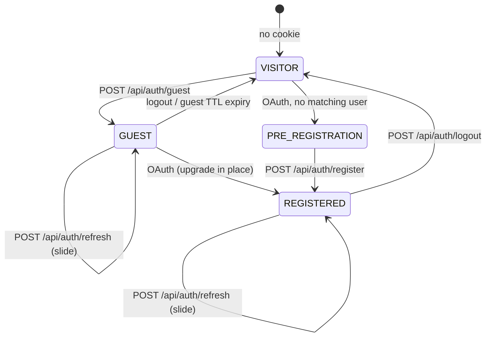
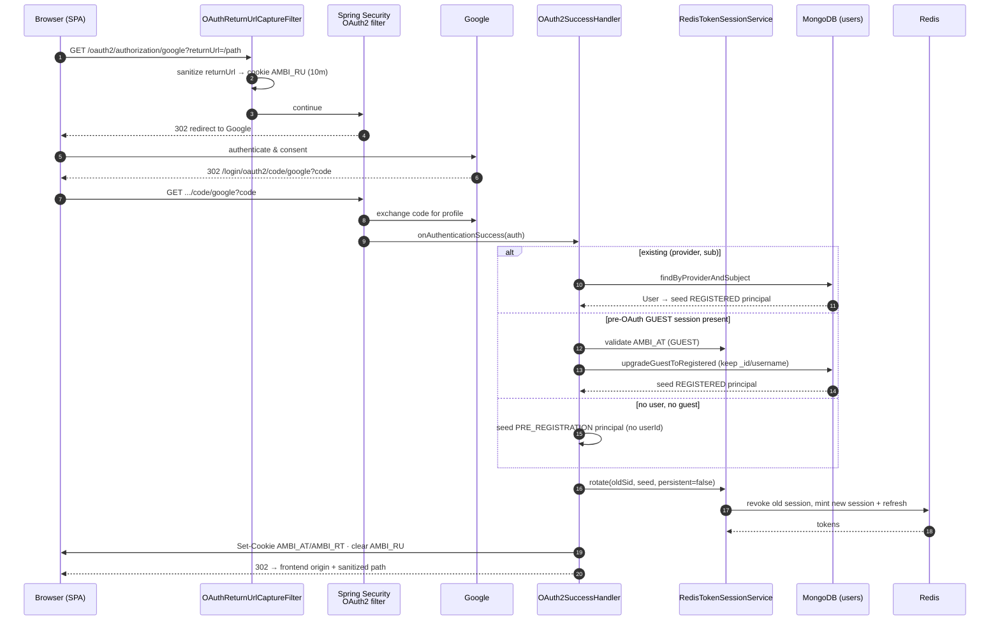
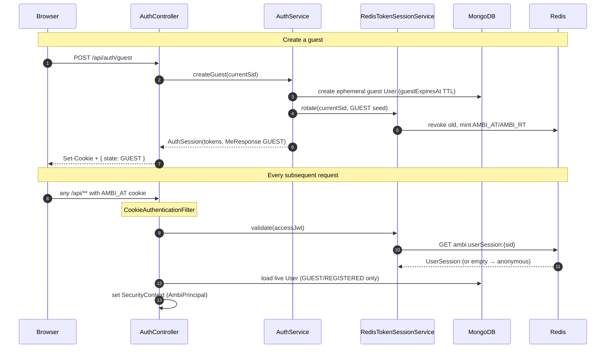
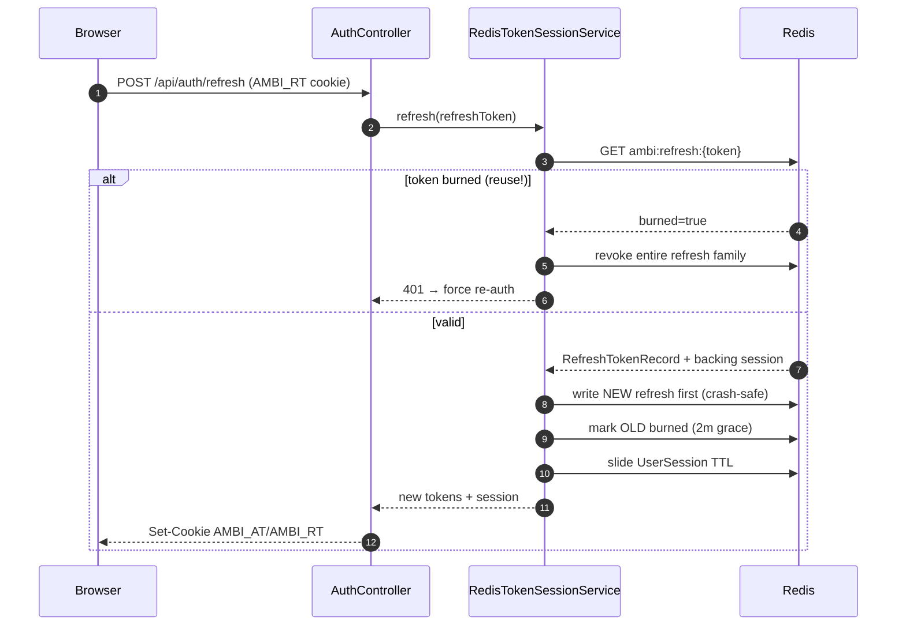
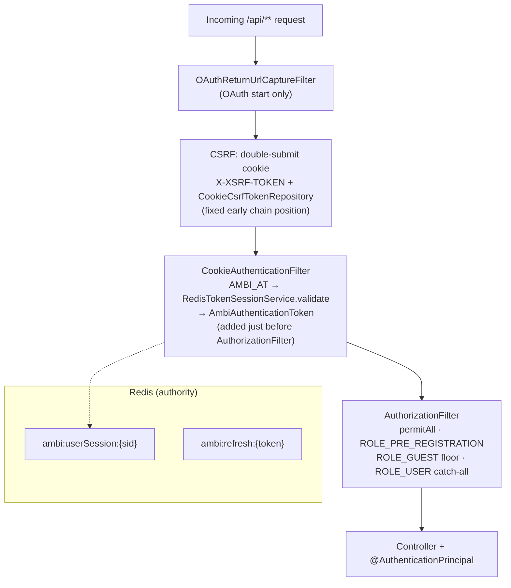

# Authentication & Sessions

Cookie-based auth with Redis as the authoritative session store. Access
(`AMBI_AT`) and refresh (`AMBI_RT`) tokens are HttpOnly cookies; the servlet
session is **stateless** — every request is validated against Redis.

Entry points: `SecurityConfig`, `CookieAuthenticationFilter`,
`OAuth2SuccessHandler`, `RedisTokenSessionService`. Client side:
[Frontend Architecture](frontend-architecture.md#auth-state-machine).

Three providers are wired — Google and Microsoft (OIDC, keyed on `sub`) and
Discord (plain OAuth2, keyed on `id`, unverified email treated as absent). The
flow below is identical for all three; only the claim mapping differs.

## Identity state machine

Every caller resolves to one of four states via `GET /api/auth/me` (never 401s).
`PRE_REGISTRATION` identity lives only in the session — no `User` document yet.
`/refresh` is `permitAll` with no identity check: it slides whichever session
cookie it is given, in any state.

## OAuth 2.0 login (Google shown; Discord/Microsoft are identical)

## Guest creation & per-request validation

## Refresh — sliding rotation with reuse detection

`AMBI_AT` is short-lived; `AMBI_RT` slides the session. Refresh tokens rotate on
every use with a burn-and-grace window so a replayed (stolen) token trips
family-wide revocation.

## Security filter chain

