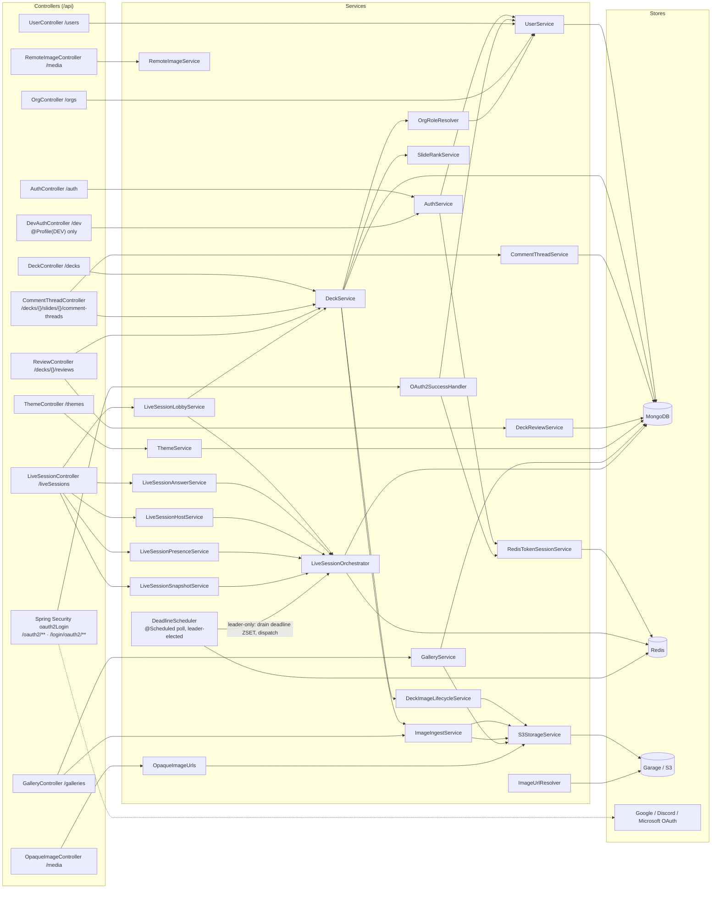
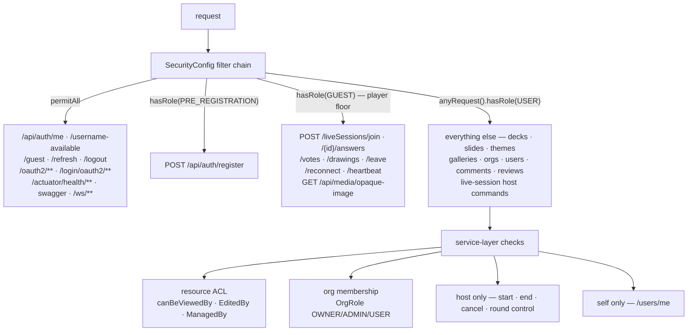

# Backend Service Map

One picture of the whole backend: every controller, its route prefix, the
services it drives, and the collections/stores behind them. All endpoints are
prefixed `/api` and documented live at `/swagger-ui/`.

Per-feature deep dives: [Deck Authoring](deck-authoring.md),
[Live Session](live-session.md), [Media & Gallery](media-gallery.md),
[Collaboration](collaboration.md), [Authentication](authentication.md).

## Controllers → services → stores

## Authorization model

Two stages: the `SecurityConfig` filter chain decides *what level of principal*
may reach a route, then the service layer decides *whether this principal may
touch this resource*. The chain has exactly four buckets — the matchers below
are the whole list, in order, and everything not matched falls to
`.anyRequest().hasRole("USER")`.

**There are no anonymous read routes.** `GET /api/decks/public` and
`GET /api/themes/built-in` require a registered user like everything else — they
are public in *visibility*, not in *authentication*. `hasRole("GUEST")` is a
minimum level, not an exact one: `AuthorityResolver` grants a cumulative
`ROLE_<LEVEL>`, so registered users satisfy it too while visitors and
pre-registration principals don't. Under the `DEV` profile only, an ordered
`/api/dev/**` chain (`DevSecurityConfig`) permits all and skips CSRF.

## Collections & repositories

| Aggregate | Repository | Collection |
|---|---|---|
| User | `UserRepository` | `users` |
| Deck | `DeckRepository` | `decks` (slides embedded) |
| Theme | `ThemeRepository` | `themes` |
| Gallery | `GalleryRepository` | `galleries` |
| GalleryImage | `GalleryImageRepository` | `gallery_images` |
| AppImage | — | `app_images` |
| CommentThread | `CommentThreadRepository` | `comment_threads` |
| DeckReview | `DeckReviewRepository` | `deck_reviews` |
| DeckAnalytics | — | `deck_analytics` |
| LiveSession | `LiveSessionRepository` | `LiveSessions` |
| Participant | `ParticipantRepository` | `participants` |
| Answer | `AnswerRepository` | `answers` |
| RoundResult | `RoundResultRepository` (package-private) | `round_results` |

Volatile live-session state (locks, round state, tallies, answers, presence,
pub/sub) lives in **Redis** — see [Live Session](live-session.md#redis-keys).
