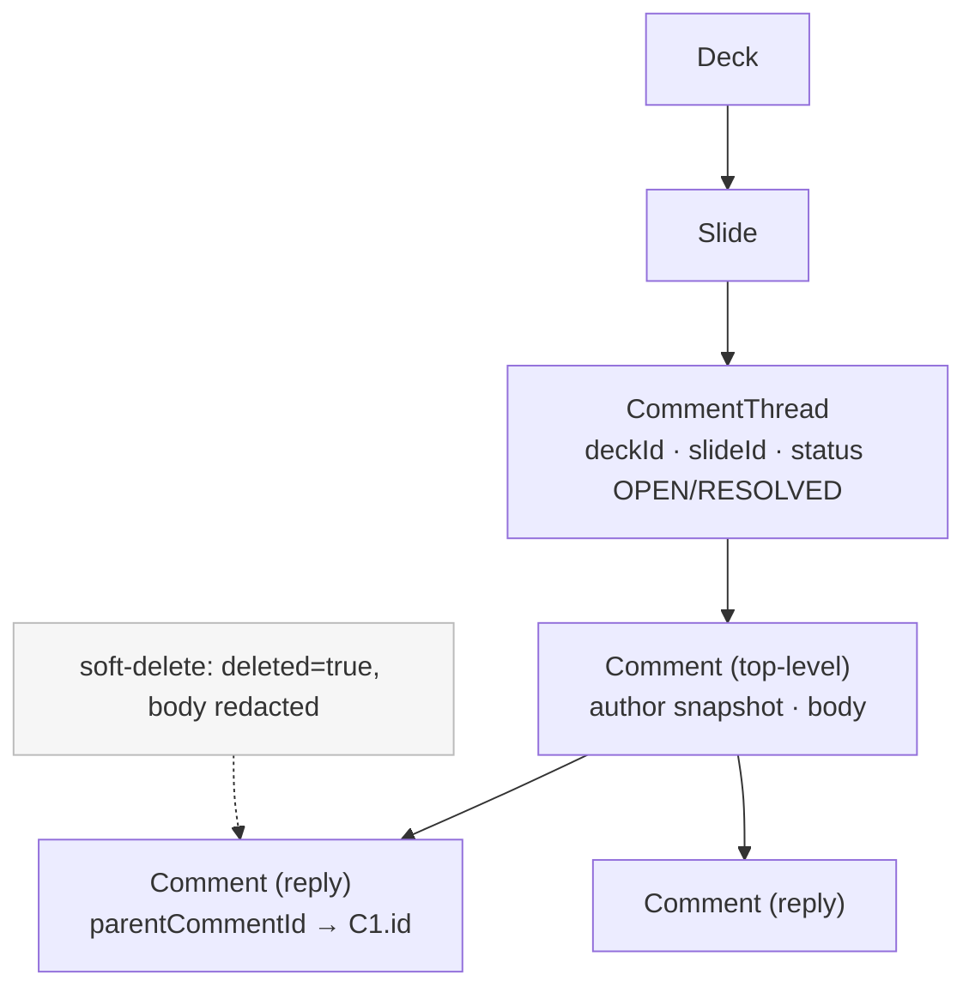
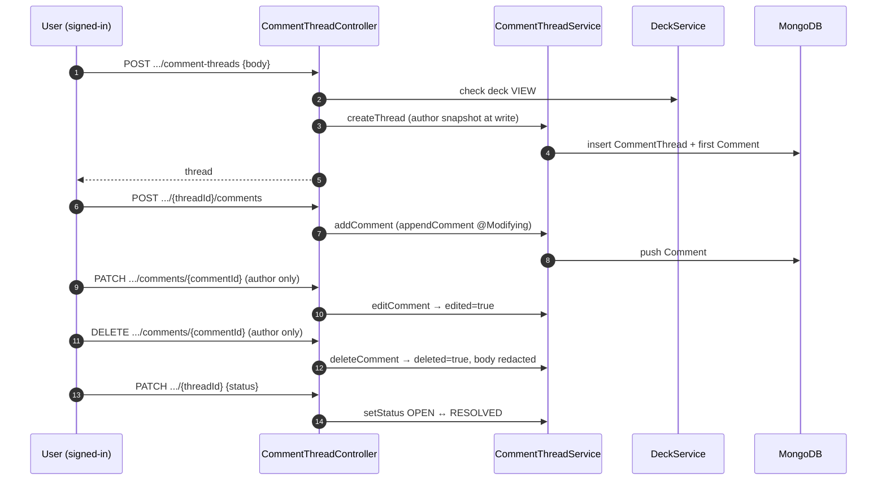
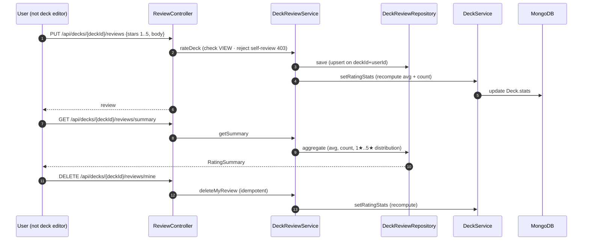
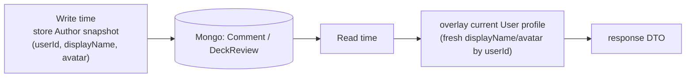

# Collaboration — Comments & Reviews

Two feedback surfaces on a deck: **comment threads** anchored to a slide, and
**star reviews** of the whole deck. Both snapshot the author's profile at write
time and overlay the current profile on read, and both gate reads on deck VIEW.

Key classes: `CommentThreadController`, `CommentThreadService`,
`ReviewController`, `DeckReviewService`, `DeckService`. Data shapes:
[Domain Model — Content](domain-model.md#content--decks-slides-theming-feedback).

## Comment thread model

## Comment lifecycle

## Review rating flow

One review per (deck, user) via a compound unique index; self-review is barred.
Writing a review recomputes the deck's denormalized rating summary.

## Read overlay — snapshot vs live profile

