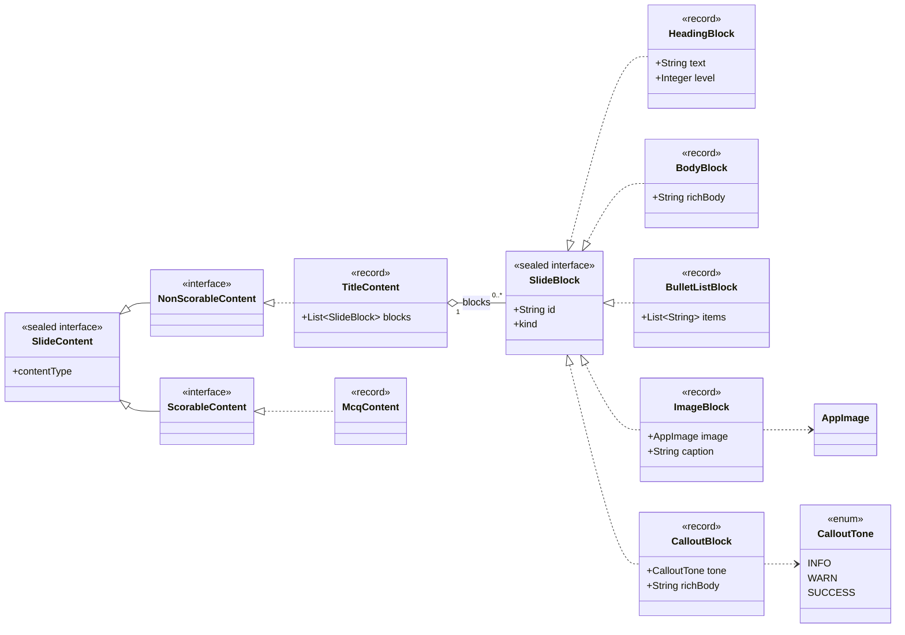
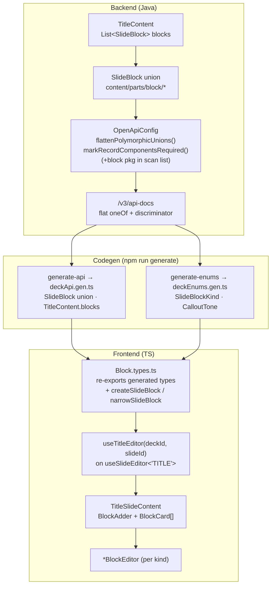
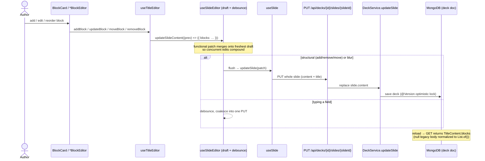
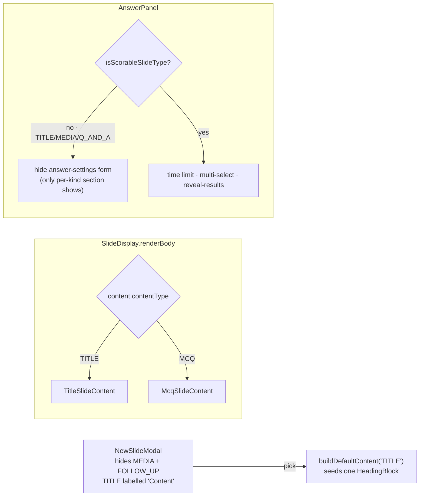

# Content Slide (non-scorable, block-based)

The **Content slide** is the first non-scorable slide type — a PowerPoint-style
display slide whose body is an ordered, polymorphic list of *blocks* (heading,
body text, bullet list, image, callout). It reuses the exact discriminated-union
pattern the MCQ content already uses, one level deeper: a slide's `content` is a
`SlideContent` union keyed by `contentType`, and a content slide's body is a
nested `SlideBlock` union keyed by `kind`.

It is surfaced in the editor as the **"Content"** tile (backed by the `TITLE`
`SlideType`); `MEDIA` and `FOLLOW_UP` are hidden from the picker.

Prose/data companions: [deck-authoring](deck-authoring.md),
[Domain Model](domain-model.md),
[deck-editor](../features/deck-editor/README.md),
[generated-artifacts](../rules/frontend/generated-artifacts.md).

## Content & block model

Two nested discriminated unions. Cross-cutting authoring knobs (points,
difficulty, shuffle) are **not** here — they live on `Slide` / `SlideSettings`.

## End-to-end type flow (backend → generated client → editor)

The block types are **backend-owned and generated**; the frontend never
hand-writes them. `OpenApiConfig` is generic — the same customizers that flatten
`SlideContent` also flatten the nested `SlideBlock` union with no extra code.

## Authoring & persistence round-trip

Every block edit funnels through one debounced draft and lands as a single
whole-slide `PUT` — the same path MCQ uses. Structural ops (add/remove/move)
flush immediately; field typing debounces.

## Editor dispatch & non-scorable gating

Adding a slide type touches two `switch`es and the picker; a content slide also
suppresses the answer-settings form (it has no score/answer).

## Adding another block kind

Mirrors the `SlideContent` ritual, scoped to `SlideBlock`:

1. New record implementing `SlideBlock` + a `@JsonSubTypes.Type` and a
   `oneOf`/`@DiscriminatorMapping` entry on `SlideBlock` (`content/parts/block`).
2. `npm run generate` — the generic flattener + codegen produce the new TS arm.
3. Frontend: a `*BlockEditor`, a `BlockCard` dispatch arm, and a
   `BLOCK_KIND_OPTIONS`/`BLOCK_KIND_LABEL`/`createSlideBlock` entry in
   `Block.types.ts`.
