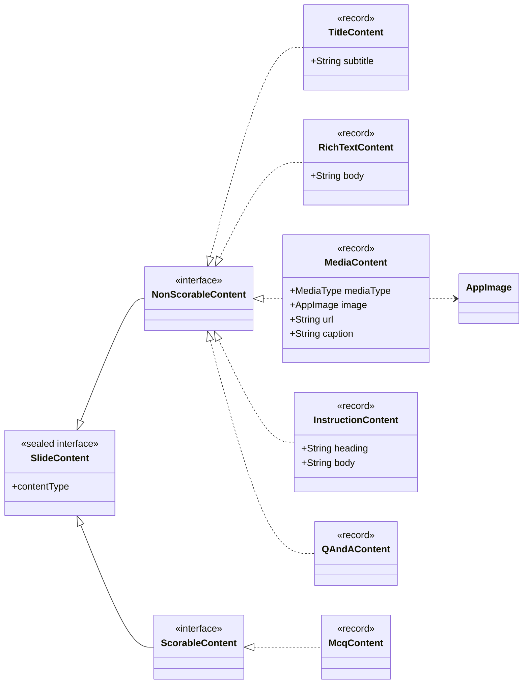
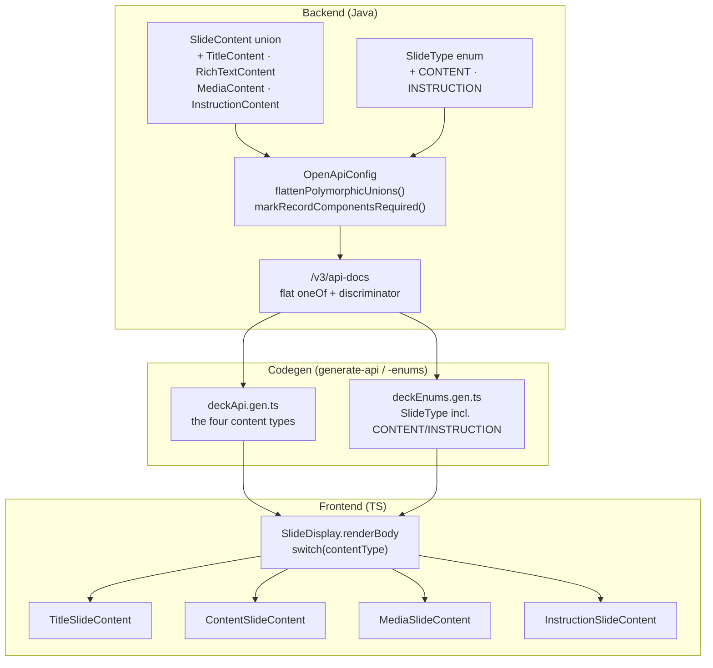
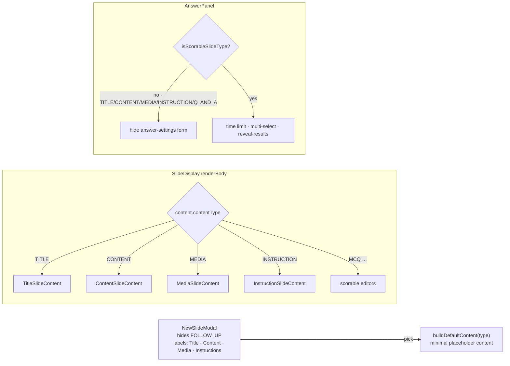

# Non-scorable slide types

Ambi has four **non-scorable** display slide types — the "PowerPoint, but with
less functionality" set. None takes a player answer or produces a score; each is
a flat content record (0–2 fields) on the existing `SlideContent` discriminated
union, keyed by `contentType`:

| Type | `contentType` | Record | Body |
|---|---|---|---|
| Title | `TITLE` | `TitleContent` | optional `subtitle` (headline is the slide `title`) |
| Content | `CONTENT` | `RichTextContent` | a single rich-text `body` (HTML) |
| Media | `MEDIA` | `MediaContent` | an image **or** an embedded YouTube video + optional `caption` |
| Instruction | `INSTRUCTION` | `InstructionContent` | optional `heading` / `body`; join URL + code filled in at session time |

> An earlier iteration modelled the Content slide as an ordered polymorphic
> `List<SlideBlock>` (heading/body/bullet/image/callout). That was pulled out in
> favour of these four purpose-built flat types — there is no block union.

Media video is **embedded YouTube only** — we do not host or serve video. A
"video" media slide is `MediaContent` with `mediaType = EMBED` and a YouTube
`url`.

Prose/data companions: [deck-authoring](deck-authoring.md),
[Domain Model](domain-model.md),
[deck-editor](../features/deck-editor/README.md),
[generated-artifacts](../rules/frontend/generated-artifacts.md).

## Content model

Each type is a record on the `SlideContent` sealed union, reached through the
`NonScorableContent` sub-interface. Cross-cutting authoring knobs (points,
difficulty, shuffle) are **not** here — they live on `Slide` / `SlideSettings`.



## End-to-end type flow (backend → generated client → editor)

The content records are **backend-owned and generated**; the frontend never
hand-writes them. Adding a type is one `@JsonSubTypes.Type` + one `oneOf` + one
`@DiscriminatorMapping` on `SlideContent`, plus a `permits` entry on
`NonScorableContent`; `OpenApiConfig` flattens the union for the client.



## Authoring & persistence round-trip

Every editor sits on the generic `useSlideEditor(deckId, slideId, KIND)` and
commits through one debounced whole-slide `PUT` — the same path MCQ uses. The
slide title flows through `updateMetadata`; the content fields through
`updateSlideContent`.

```mermaid
sequenceDiagram
    actor Author
    participant Editor as *SlideContent editor
    participant SE as useSlideEditor (draft + debounce)
    participant S as useSlide
    participant API as PUT /api/decks/{id}/slides/{slideId}
    participant DS as DeckService.updateSlide
    participant DB as MongoDB (deck doc)

    Author->>Editor: edit title / subtitle / body / media / instructions
    Editor->>SE: updateMetadata / updateSlideContent
    Note over SE: patches merge onto the freshest draft;<br/>structural edits (image pick, mode switch) flush now
    SE->>S: flush → updateSlide(patch)
    S->>API: PUT whole slide (content + title)
    API->>DS: replace slide.content
    DS->>DB: save deck (@Version optimistic lock)
    Note over DB: reload → GET returns the typed content arm
```

## Editor dispatch & non-scorable gating

Adding a type touches the `SlideDisplay.renderBody` switch, the `NewSlideModal`
picker (label + graphic), `buildDefaultContent`, and the answer-panel gate; a
non-scorable slide suppresses the answer-settings form (it has no score/answer).



## Follow-ups

- **Live-session board rendering** of these four kinds — especially runtime join
  URL/code substitution for the Instruction slide, which the editor only previews
  with `{join link}` / `{code}` placeholders.
- **A richer Content-slide editor** — v1 uses the shared `RichTextInput`.
- **Media** autoplay/loop/muted controls (kept in the model, not yet surfaced).
