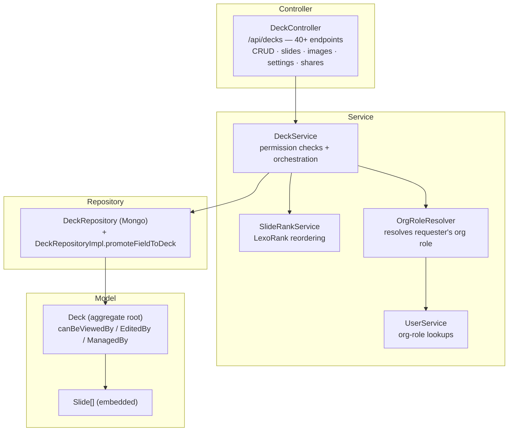
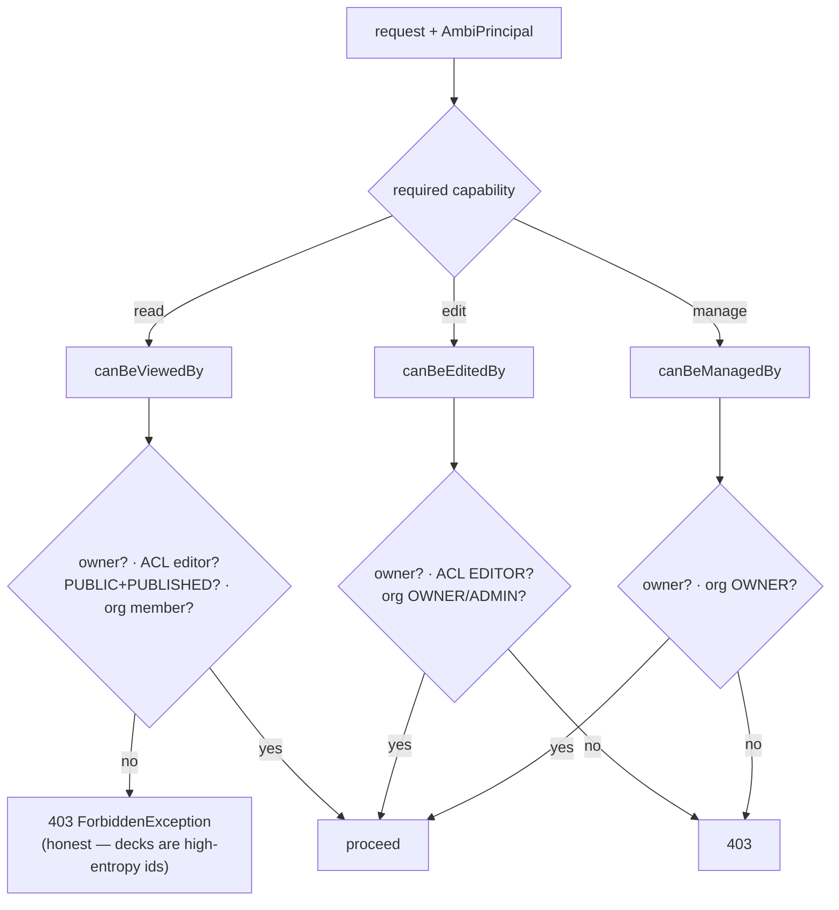
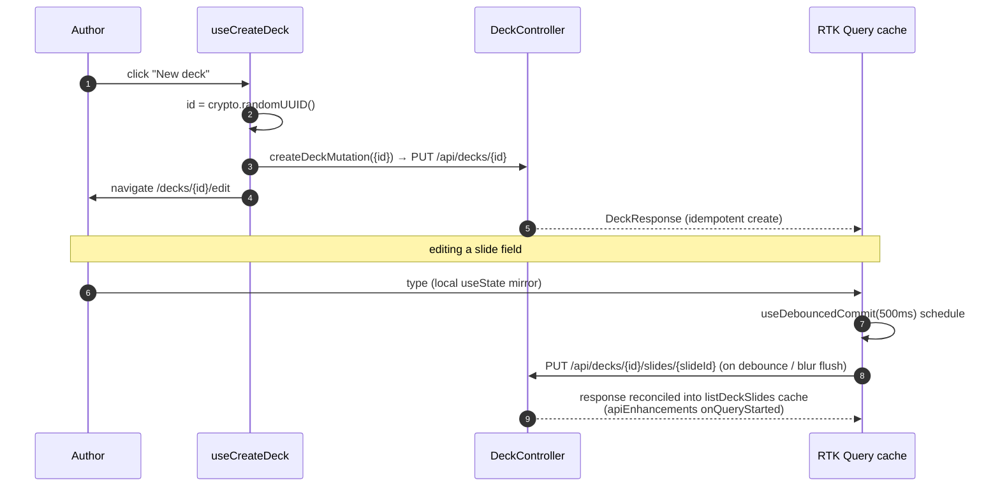
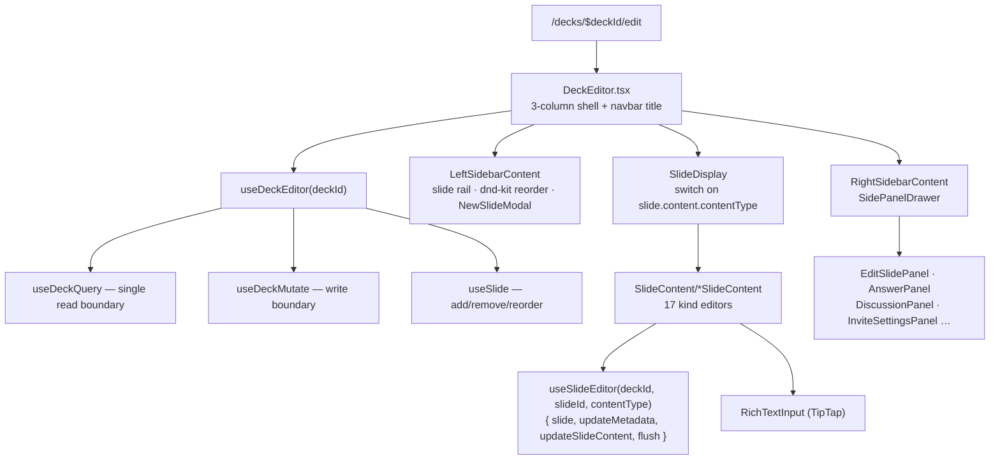
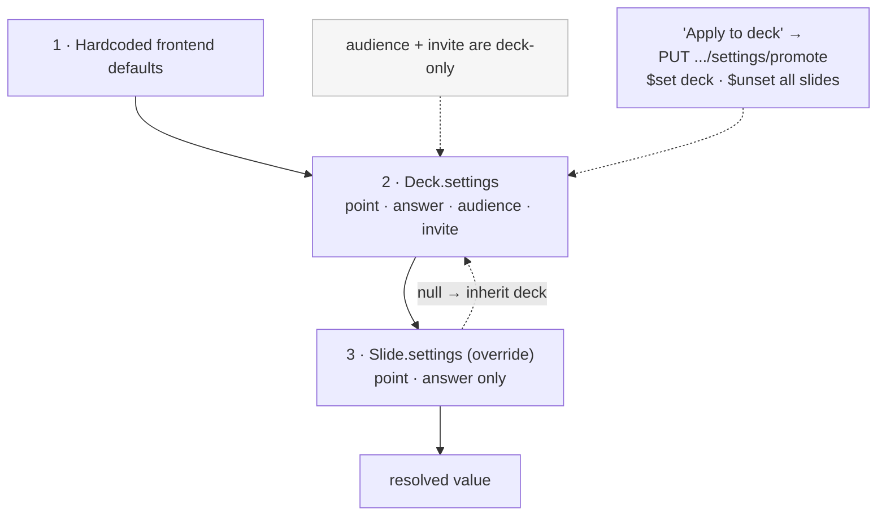
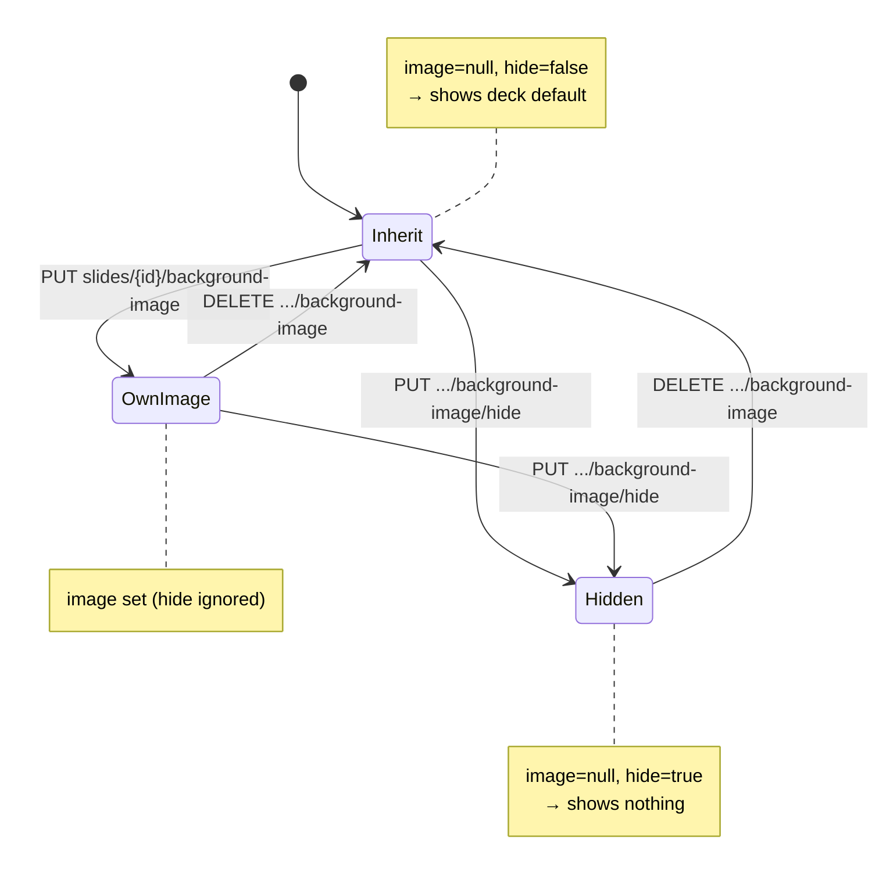

# Deck Authoring

The deck editor (`/decks/$deckId/edit`) and its backend. A `Deck` is the
aggregate root; slides are embedded, so most writes go through `DeckService`
and rewrite the deck under an `@Version` optimistic lock (targeted `$set`/`$unset`
updates for settings promotion).

Prose companions: [deck-editor](../features/deck-editor/README.md),
[follow-up-slides](../features/follow-up-slides/README.md). Data shapes:
[Domain Model](domain-model.md). Frontend cache mechanics:
[Frontend Architecture](frontend-architecture.md).

## Backend layering

## Permission resolution

`DeckService` delegates authorization to pure predicates on the `Deck` aggregate.

## Optimistic create & edit round-trip

The frontend mints ids before the network call; the backend treats create as
idempotent.

## Frontend editor composition

## Settings resolution hierarchy

Slides override a subset of deck defaults; a null field falls through.
"Apply to deck" promotes a slide value and clears every slide's override.

### Slide background — three states

