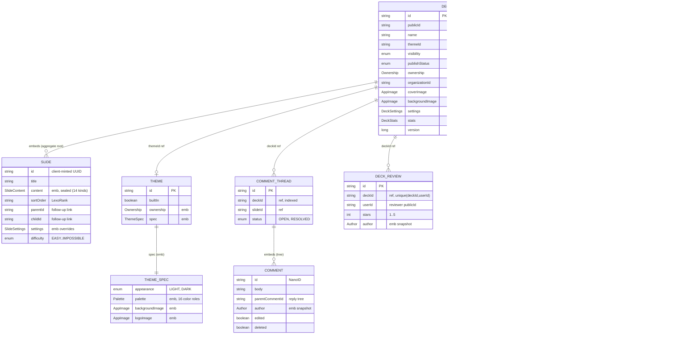
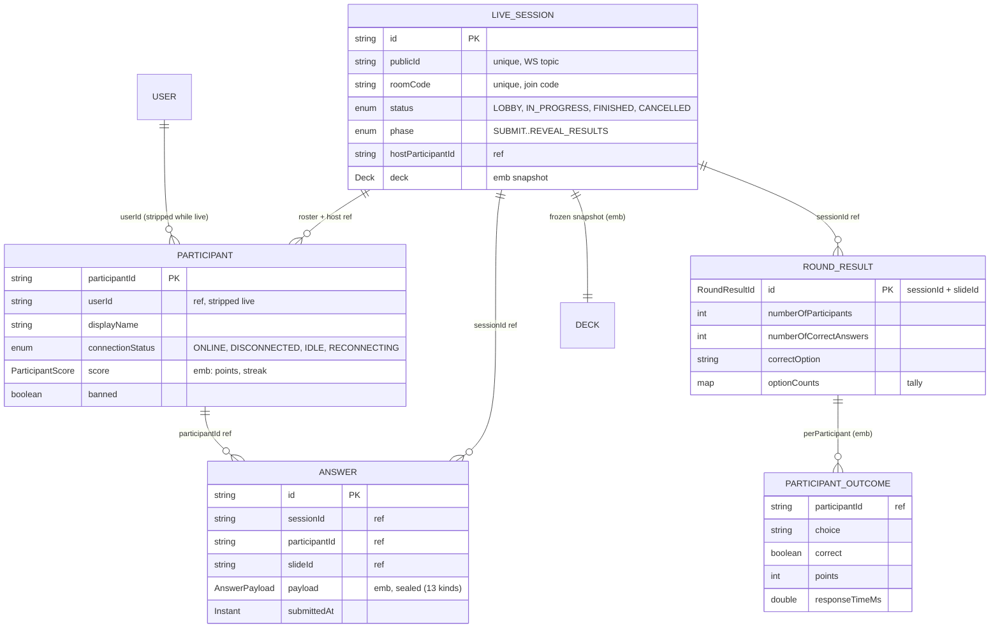
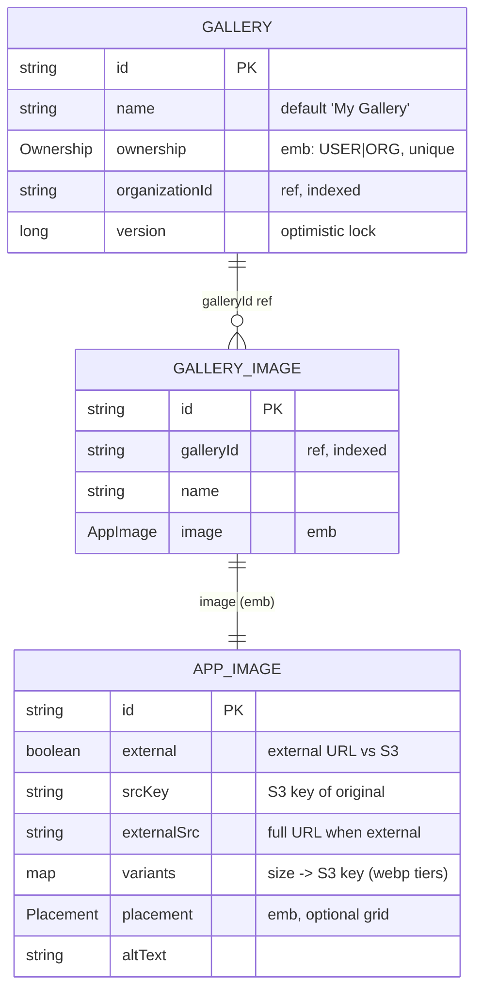
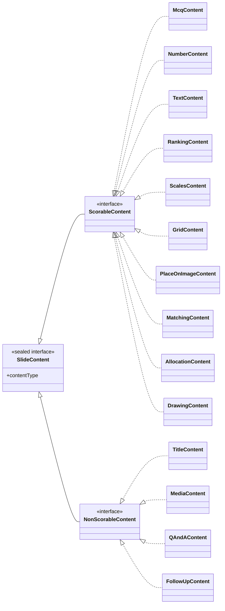
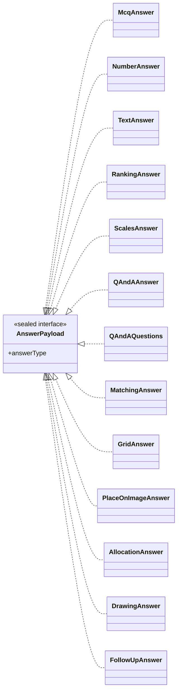

# Domain Model (ERD)

The MongoDB persistence model. Aggregate roots are separate `@Document`
collections; value objects and child entities are **embedded**. References
across aggregate boundaries are by id (no DB-level joins).

> The deck/slide/answer content model is under active rework as part of the
> backend rewrite — kind enums and field names may shift. See
> [deck-editor](../features/deck-editor/README.md) and
> [follow-up-slides](../features/follow-up-slides/README.md).

Legend: `PK` primary key · `FK`/`ref` cross-aggregate reference by id ·
`emb` embedded document · relationship crow's-foot shows cardinality.

## Identity, access & billing

> There is **no `Organization` document** — orgs exist only as ids referenced by
> `Ownership` and `OrgMembership`. `/api/orgs/mine` projects `User.orgRoles`.

## Content — decks, slides, theming, feedback

## Live session — runtime play

Durable Mongo aggregates below; the **volatile round state lives in Redis**
(see [Live Session](live-session.md)).

## Media

`AppImage` is also embedded directly into `Deck`, `Slide`, `Theme`, and
`Avatar` — the image bytes/keys are copied in when selected, so deleting a
gallery image does not remove copies already placed in a deck.

## Polymorphic content hierarchies

Both slide content and answer payloads are Jackson-polymorphic **sealed**
interfaces (discriminator persisted as `_class` / `type`). Each scorable slide
kind has a matching answer kind.

Q&A is the one payload with two kinds: `QAndAAnswer` is the wire shape a
participant submits (one free-text question); the orchestrator appends it
server-side into `QAndAQuestions`, the stored per-participant aggregate (a
player may ask several questions in a round, but the answer model keeps one
`Answer` document per participant). A client submitting `QAndAQuestions`
directly is rejected at validation.
