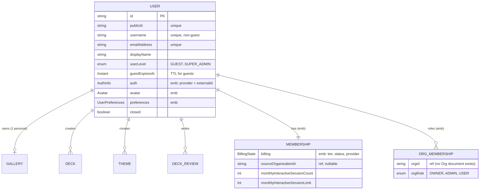
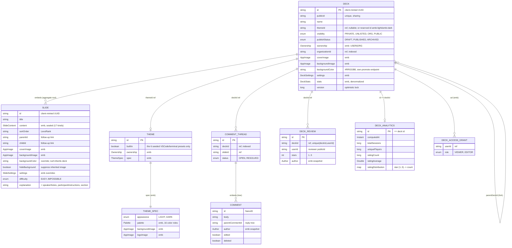
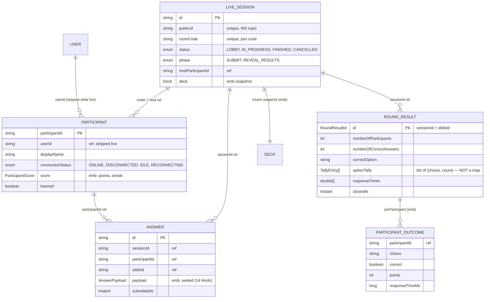
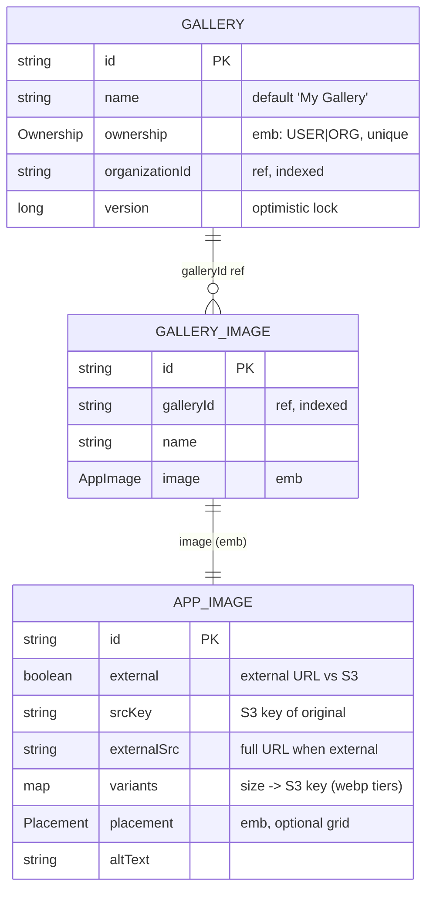
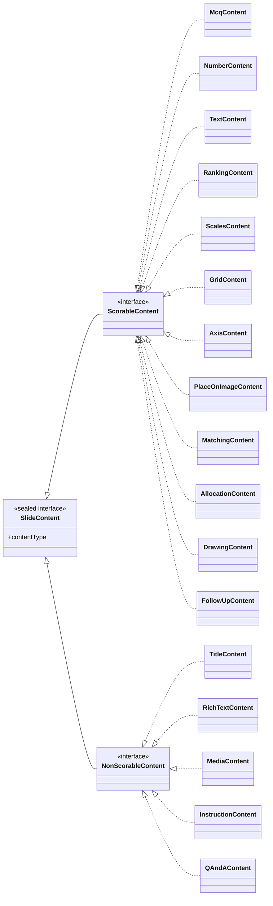

# Domain Model (ERD)

The MongoDB persistence model. Aggregate roots are separate `@Document`
collections; value objects and child entities are **embedded**. References
across aggregate boundaries are by id (no DB-level joins).

Blocks show the fields other aggregates or the API depend on, not every field.
Legend: `PK` primary key · `ref` cross-aggregate reference by id · `emb`
embedded. The deck/slide/answer content model is still under rework — see
[deck-editor](../features/deck-editor/README.md) and
[follow-up-slides](../features/follow-up-slides/README.md).

## Identity, access & billing

> There is **no `Organization` document** — orgs exist only as ids referenced by
> `Ownership` and `OrgMembership`. `/api/orgs/mine` projects `User.orgRoles`.

## Content — decks, slides, theming, feedback

`DeckAnalytics` is a ~30-field precomputed record (play counts, score and
duration distributions, per-slide difficulty stats, hardest/easiest slide ids);
only the fields other aggregates read are shown. `ratingDistribution` really is a
`Map<Integer,Integer>` — integer keys, so the dot problem below doesn't apply.

## Live session — runtime play

Durable Mongo aggregates below; the **volatile round state lives in Redis**
(see [Live Session](live-session.md)).

> `optionTally` is a **list of `TallyEntry(choice, count)` records, not a map** —
> deliberately. Choice strings are used verbatim as keys and can contain a `.`
> (a NUMBER round keys on `"42.5"`, a free-text round on `"Mr. Smith"`), and
> MongoDB forbids dots in field names, so a map fails to persist the whole
> document. `RoundResult.optionCounts()` rebuilds the map view the reveal events
> expose. Do not "simplify" this back to a `Map`.

## Media

`AppImage` is also embedded directly into `Deck`, `Slide`, `Theme`, and
`Avatar`. Only the deck/slide case owns independent bytes — see
[Deck image ownership](media-gallery.md#deck-image-ownership-copy-on-select).

## Polymorphic content hierarchies

Both slide content and answer payloads are Jackson-polymorphic **sealed**
interfaces (discriminator persisted as `_class` / `type`). Each scorable slide
kind has a matching answer kind.

`AnswerPayload` is a flat sealed interface of 14: `Mcq`, `Number`, `Text`,
`Ranking`, `Scales`, `QAndAAnswer`, `QAndAQuestions`, `Matching`, `Grid`, `Axis`,
`PlaceOnImage`, `Allocation`, `Drawing`, `FollowUp`.

Q&A is the one payload with two kinds: `QAndAAnswer` is the submitted wire shape
(one free-text question); the orchestrator appends it into `QAndAQuestions`, the
stored per-participant aggregate, keeping one `Answer` document per participant.
Submitting `QAndAQuestions` directly is rejected at validation.
