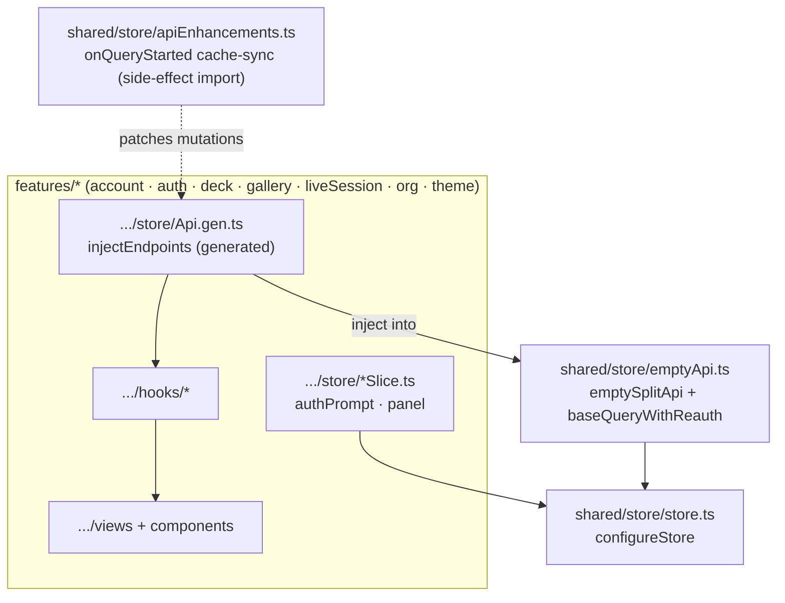
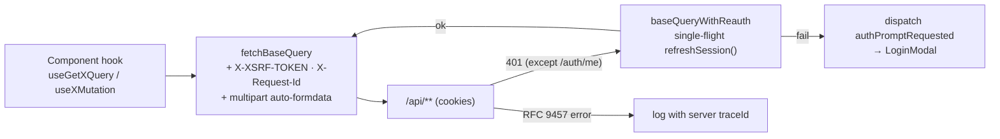
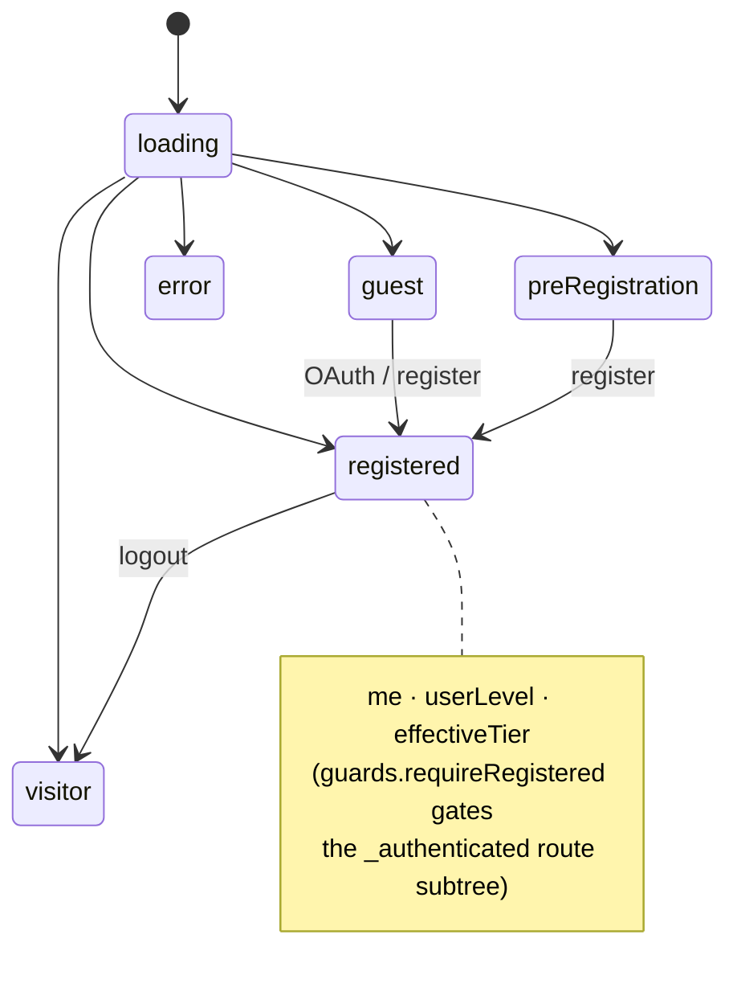
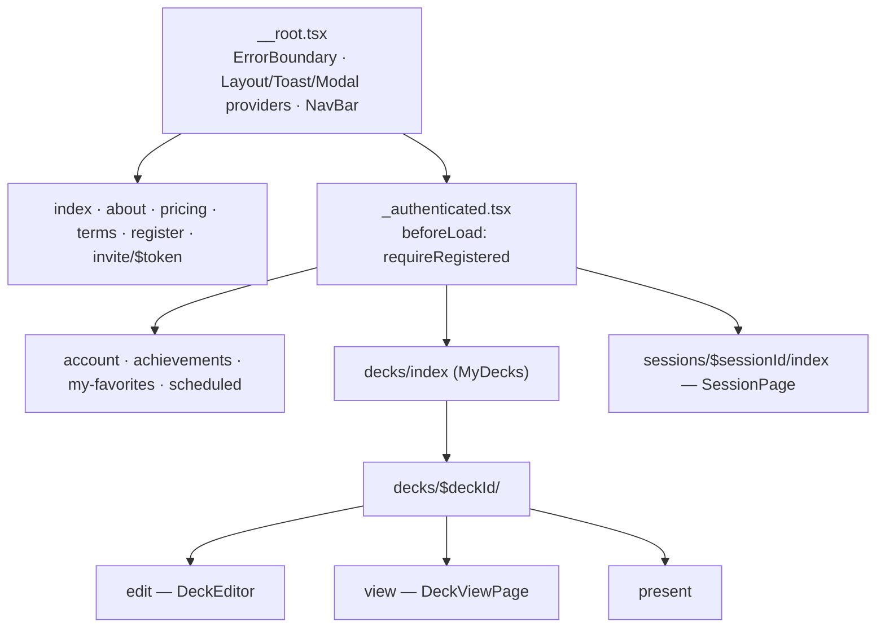
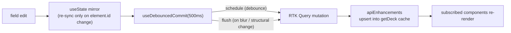
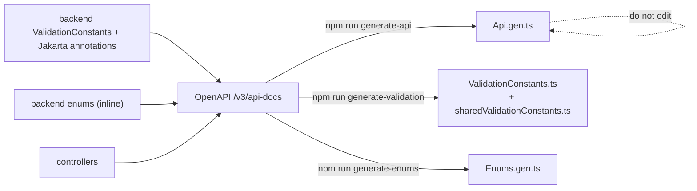

# Frontend Architecture

React 19 + TypeScript SPA. Feature-sliced modules, TanStack file-based routing,
Redux Toolkit for UI chrome, and RTK Query (injected from an empty base API) as
the primary server-state cache. API clients, validation bounds, and enums are
**generated** from the backend OpenAPI schema — never hand-edited.

Conventions: [frontend-rules](../rules/frontend-rules.md). Cache mechanics:
[rtk-query-cache](../rules/frontend/rtk-query-cache.md). Auth backend:
[Authentication](authentication.md).

## Module & store composition

## Request pipeline & re-auth

## Auth state machine (client)

`useCurrentUser()` branches on the discriminated `state` field returned by
`GET /api/auth/me` (a probe that always returns 200).

## Routing tree (TanStack, file-based)

## Deck editor commit flow

See [Deck Authoring](deck-authoring.md#frontend-editor-composition) for the full
component tree; the write path is:

## Generated artifacts pipeline

