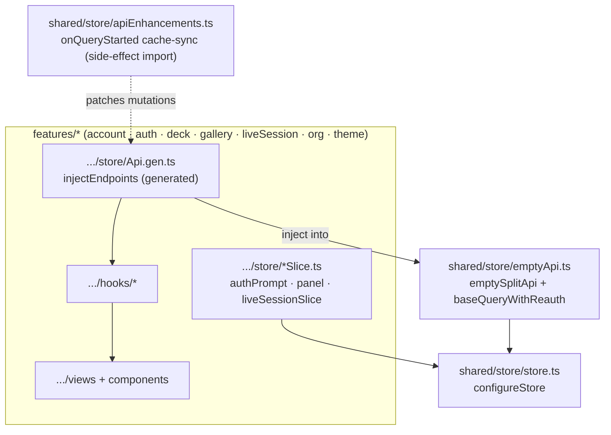
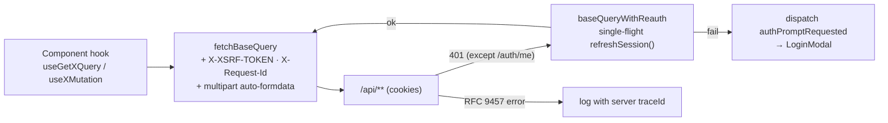
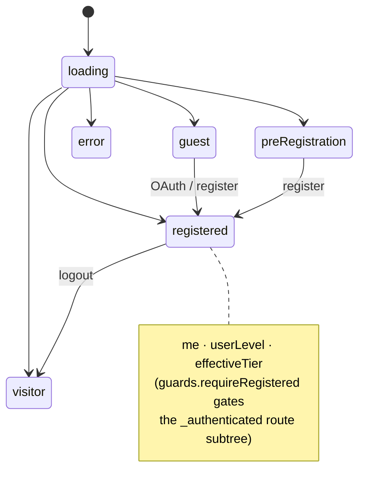
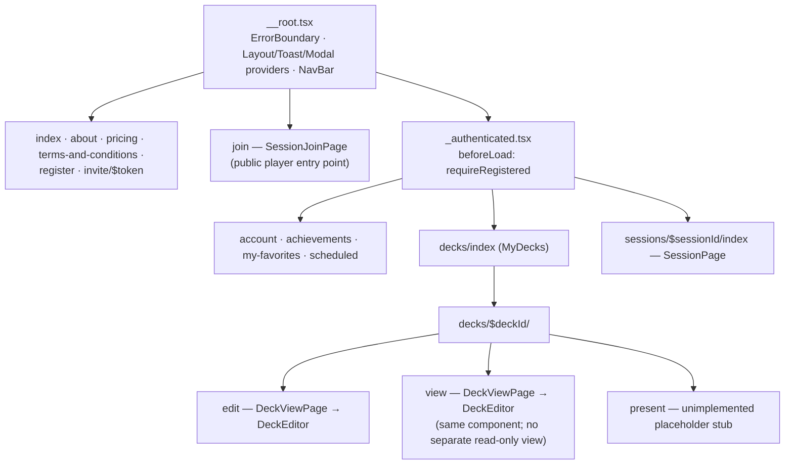
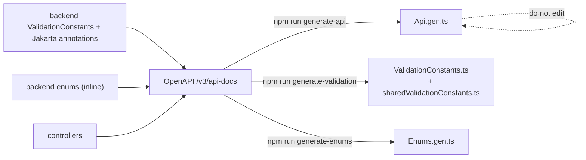

# Frontend Architecture

React 19 + TypeScript SPA. Feature-sliced modules, TanStack file-based routing,
Redux Toolkit for UI chrome, and RTK Query (injected from an empty base API) as
the primary server-state cache. API clients, validation bounds, and enums are
**generated** from the backend OpenAPI schema — never hand-edited.

Conventions: [frontend-rules](../rules/frontend-rules.md). Cache mechanics:
[rtk-query-cache](../rules/frontend/rtk-query-cache.md). Auth backend:
[Authentication](authentication.md).

## Module & store composition

## Request pipeline & re-auth

## Auth state machine (client)

`useCurrentUser()` branches on the discriminated `state` field returned by
`GET /api/auth/me` (a probe that always returns 200).

## Routing tree (TanStack, file-based)

Plus `login-error` at the root level. The editor write path is drawn in
[Deck Authoring](deck-authoring.md#optimistic-create--edit-round-trip).

## Deck mutation cache reconcile

The base API defines no `tagTypes`, so deck-level edits don't invalidate and
refetch — each mutation's `onQueryStarted` reconciles the caches by hand from its
own `DeckResponse` (`features/deck/store/enhancements/deck.ts`). Two caches hold
the same deck and **both** must be patched, or the untouched one goes stale until
a refetch:

- **`getDeck`** — backs the editor. Optimistically patched first for an instant
  preview, then whole-object replaced from the response.
- **`listMyDecks`** — backs the My Decks grid. The matching card is patched with
  the same response; `updateQueryData` is a no-op if the grid was never visited.
- `listDecksForOrg` / `listPublicDecks` have no consumer today and are not
  patched. `deleteDeck` is the mirror case (`optimisticDeleteDeck` splices the
  deck out of the same list caches) — extend both paths together when a consumer
  appears.

## Generated artifacts pipeline

