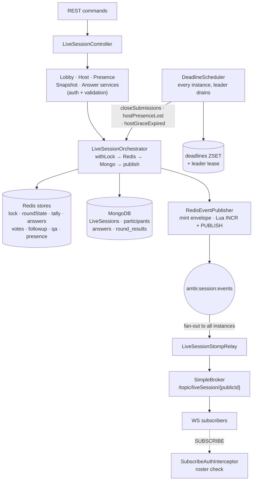
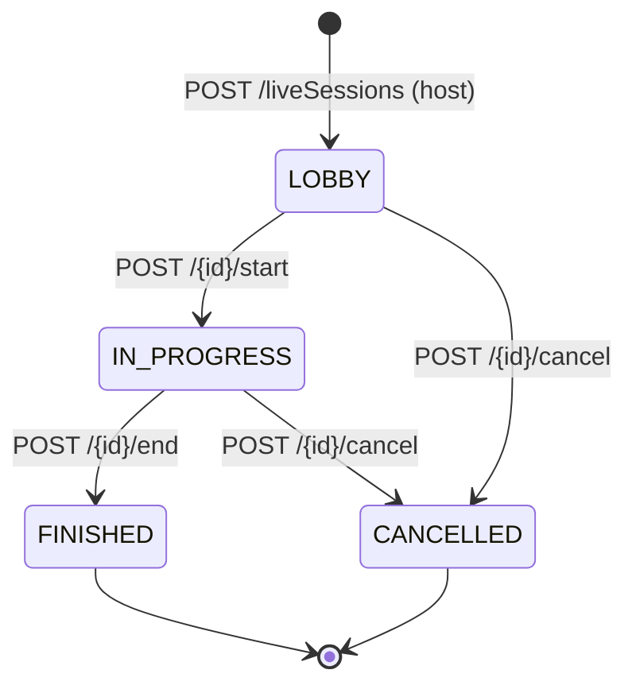
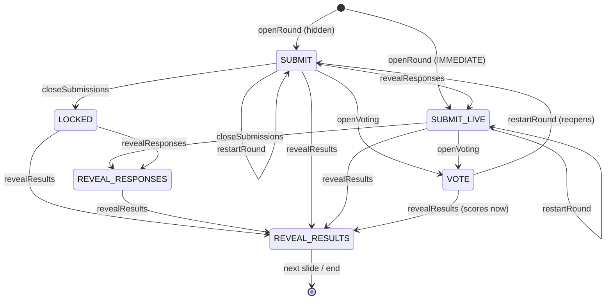
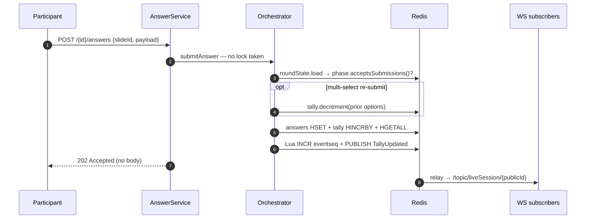

# Live Session

Real-time interactive play of a deck. A `LiveSession` snapshots the deck at
creation; **durable identity/roster live in MongoDB**, **volatile round state
lives in Redis**. Every transition publishes a `SessionEvent` onto one Redis
pub/sub channel, which each instance's relay re-emits to its local STOMP broker.

`LiveSessionController` (`/api/liveSessions`) → `LiveSessionLobbyService` /
`HostService` / `PresenceService` / `SnapshotService` /
`answer.LiveSessionAnswerService` → `LiveSessionOrchestrator`, the only writer of
live state. Timers: [ADR 002](../decisions/002-live-session-round-timers.md).
Event contract: [live-session-events](../features/live-session-events.md).
Decisions settled during the build: [decisions taken](../decisions/README.md#decisions-taken).

## Architecture

`LiveRoundState` carries `phase`, `currentSlideId`, `publicId`,
`roundStartedAt`, `durationMs`, `pausedAt`, `accumulatedPauseMs`, `autoPaused` —
`publicId` rides along so a locked transition has the topic handle without a
Mongo read.

### Redis keys

| Store | Key | Shape |
|---|---|---|
| `SessionLocks` | `ambi:session:lock:{sid}` | `SET NX`, 10s lease, Lua compare-and-delete |
| `LiveRoundStateStore` | `…:roundstate:{sid}` | JSON, 6h |
| `TallyStore` | `…:tally:{sid}:{slideId}` | hash, `HINCRBY`, 6h |
| `AnswerStore` | `…:answers:{sid}:{slideId}` | hash by participantId, 6h |
| `VoteStore` | `…:votes:{sid}:{slideId}[:options]` | hash, 6h |
| `FollowUpOptionStore` | `…:followup:{sid}:{slideId}` | ordered JSON, 6h |
| `QAndAHostAnswerStore` | `…:qa-host-answers:{sid}:{slideId}` | hash, 6h, never flushed to Mongo |
| `PresenceStore` | `…:presence:{sid}` | hash, 6h |
| `EventSequenceStore` | `…:eventseq:{publicId}` | `INCR`, 6h |
| `DeadlineStore` | `ambi:session:deadlines` | global ZSET, no TTL; members `close:{sid}:{slideId}`, `hostAway:{sid}`, `graceCancel:{sid}` |
| leader lease | `…:deadline-leader` | `SET NX PX`, 15s |
| pub/sub | `ambi:session:events` | one channel for every session |

## Session lifecycle

Participants join by `roomCode` (`POST /liveSessions/join`); each join publishes
`ParticipantJoined`.

## Round phase state machine

`RoundPhase` is the one enumerated combination of *submissions × voting ×
display*. Held in `LiveRoundState`; every transition runs under the session lock,
driven by `POST /{id}/rounds/{slideId}` and its `/close`, `/open-voting`,
`/reveal-responses`, `/reveal-results`, `/restart` sub-routes.

- **Scoring happens exactly once, on the first transition out of an unscored
  phase.** Normally that is the close (`SUBMIT`/`SUBMIT_LIVE` → `LOCKED`/
  `REVEAL_RESPONSES`, or a `revealResults` that closes and scores in one step).
  `VOTE` is the exception: best-answer/deception points depend on the votes, so a
  voting round defers scoring to `VOTE → REVEAL_RESULTS` (D3). Voting can only
  open from an *open* round, and it cancels the round's auto-close deadline.
- **`restartRound` is blocked once a `RoundResult` exists** (`ROUND_ALREADY_SCORED`)
  — so only `SUBMIT`, `SUBMIT_LIVE` and `VOTE` can be restarted, since every other
  closed phase has already been scored. There is no point-reversal path. A restart
  reopens at the slide's configured opening phase.
- `acceptsSubmissions()` is true for `SUBMIT`/`SUBMIT_LIVE` only; `acceptsVotes()`
  for `VOTE` only. A timed round auto-closes through the same `closeSubmissions`
  a host click uses (ADR 002); pause/resume freeze the countdown without changing
  phase.

A slide with an attached follow-up never reaches `REVEAL_RESULTS` on its own:
`revealResults` rejects with `409 REVEAL_BLOCKED_BY_FOLLOW_UP` and the host
closes it and advances into the child, which runs this same machine — see
[follow-up slides § Runtime](../features/follow-up-slides/README.md#runtime).

## Answer submission — lock-free tally

Submissions deliberately skip the session lock; tallies use atomic `HINCRBY`.
The HTTP call returns `202 Accepted` and the updated tally arrives over WebSocket.
`submitVote` follows the same lock-free shape (one voter-keyed write).

## Round timer auto-close (ADR 002)

Opening a round with a positive `countdownTime` arms a `close:{sid}:{slideId}`
deadline in the same locked transition that saves `LiveRoundState`. Every
instance polls (default 1s), but only the Redis-lease leader drains the ZSET, so
exactly one instance ever fires a given deadline. A `SESSION_LOCKED` conflict
(the host closed manually in the same instant) re-schedules `retryDelay` (2s)
out; a vanished or terminal session drops it. Host liveness rides the same
poller: `hostAway:{sid}` fires `hostPresenceLost` (auto-pause + arm the grace
countdown) and `graceCancel:{sid}` fires `hostGraceExpired` (cancel the session).

## Event catalog

Twenty permitted `SessionEvent` types. "Locked?" is whether the publishing
transition holds the session lock.

| Event | Trigger | Locked? |
|---|---|---|
| `LiveSessionStarted` | host starts | yes |
| `ParticipantJoined` | joins by roomCode | **no** |
| `ParticipantLeft` | leaves roster | yes |
| `ParticipantReconnected` | rejoins | **no** |
| `ParticipantRemoved` | defined, **never published** (dead) | — |
| `PresenceChanged` | host presence lost (ADR 002) | yes |
| `RoundStarted` | round opens hidden; carries `deadline` if timed | yes |
| `LiveResultsShown` | opened live / gone live mid-round; carries `deadline` | yes |
| `TallyUpdated` | answer submitted | **no** |
| `QAndAUpdated` | question asked, or host answered/cleared one | **no** |
| `SubmissionsLocked` | submissions closed (hidden) | yes |
| `VotingOpened` | voting opened; carries the anonymised `VoteOptionView`s | yes |
| `VoteCast` | vote recorded; carries the running count only | **no** |
| `ResponsesRevealed` | responses shown | yes |
| `ResultsRevealed` | scored reveal | yes |
| `RoundRestarted` | round restarted; carries the fresh `deadline` | yes |
| `TimerPaused` | timer paused (host or host-disconnect auto-pause) | yes |
| `TimerResumed` | timer resumed; carries the recomputed `deadline` | yes |
| `LiveSessionEnded` / `Cancelled` | session terminal (expired host grace also cancels) | yes |
