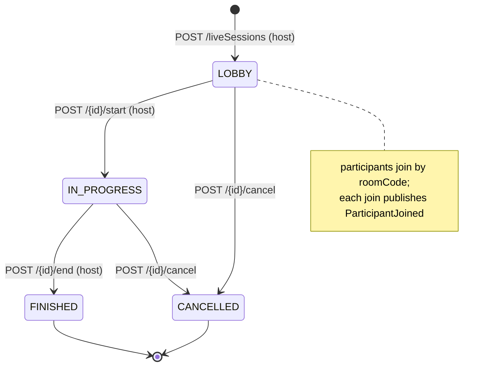
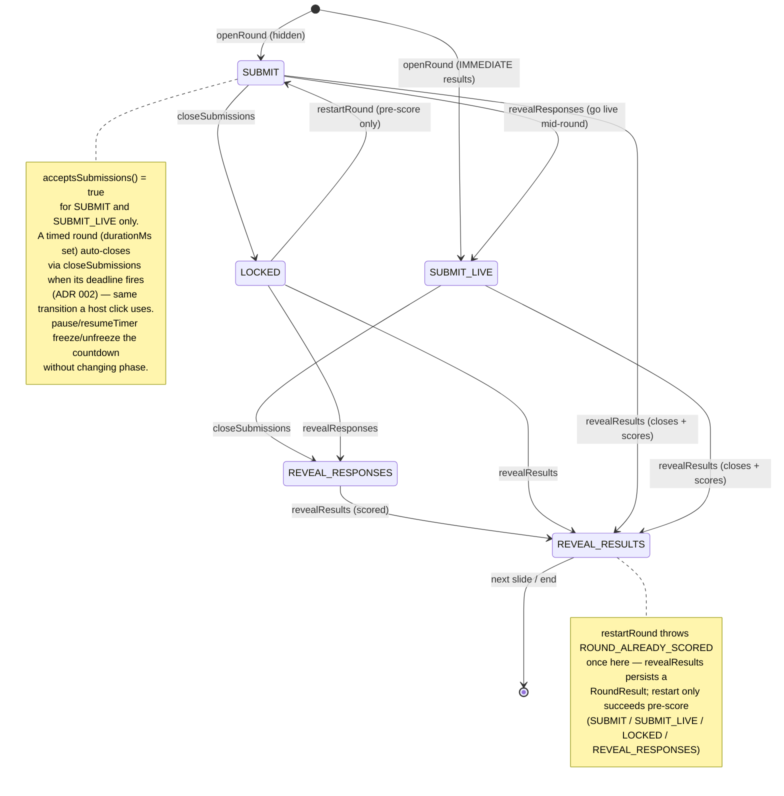
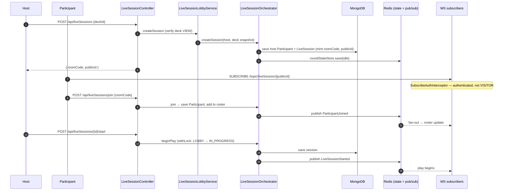
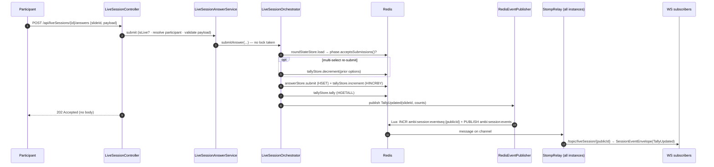

# Live Session

Real-time interactive play of a deck. A `LiveSession` snapshots the deck at
creation; **durable identity/roster live in MongoDB** while **volatile round
state lives in Redis**. Every state transition publishes a `SessionEvent` that
fans out over one Redis pub/sub channel and is relayed to STOMP subscribers.

> The transport & Redis-store architecture and the `startRound` publish
> sequence are documented in [live-session-flow.md](../live-session-flow.md) —
> this page adds the lifecycle/phase state machines and the join & answer
> sequences. Open questions: [live-session-open-decisions.md](../live-session-open-decisions.md).

Key classes: `LiveSessionController`, `LiveSessionLobbyService`,
`LiveSessionAnswerService`, `LiveSessionHostService` (owns
close/reveal/restart/advance/goTo/pause-timer/resume-timer),
`LiveSessionSnapshotService`, `LiveSessionPresenceService`,
`LiveSessionOrchestrator`, `SessionLocks`, `TallyStore`, `AnswerStore`,
`LiveRoundStateStore`, `PresenceStore`, `QAndAHostAnswerStore`,
`RedisEventPublisher`, `LiveSessionStompRelay`, `SubscribeAuthInterceptor`,
`DeadlineScheduler` / `DeadlineStore` (the round-timer auto-close and
host-disconnect poller — see [ADR 002](../decisions/002-live-session-round-timers.md)
and [live-session-flow](../live-session-flow.md#round-timer-auto-close-adr-002)).

## Session lifecycle



## Round phase state machine

Per-round phase governs whether submissions are accepted and what viewers see.
Held in Redis `LiveRoundState`; transitions run under the session lock.



A slide with an attached follow-up never reaches `REVEAL_RESULTS` on its own:
`revealResults` rejects with `409 REVEAL_BLOCKED_BY_FOLLOW_UP` and the host
closes it and advances into the child instead, which runs this same state
machine as its own ordinary round — see
[follow-up slides § Runtime](../features/follow-up-slides/README.md#runtime).

## Create → join → start



## Answer submission — lock-free tally

Submissions deliberately skip the session lock; tallies use atomic Redis
`HINCRBY`. The HTTP call returns `202 Accepted` and the updated tally arrives via
WebSocket.



## Redis stores at runtime

```mermaid
flowchart LR
    ORCH["LiveSessionOrchestrator"]
    subgraph redis["Redis (volatile, ~6h TTL)"]
        LOCK[["lock<br/>ambi:session:lock:{sid} · SET NX · 10s lease"]]
        STATE[["roundState<br/>ambi:session:roundstate:{sid} · JSON"]]
        TALLY[["tally<br/>ambi:session:tally:{sid}:{slideId} · HINCRBY"]]
        ANS[["answers<br/>ambi:session:answers:{sid}:{slideId} · HSET"]]
        VOTES[["votes (D3)<br/>ambi:session:votes:{sid}:{slideId}[:options] · HSET"]]
        FOLLOWUP[["followup<br/>ambi:session:followup:{sid}:{slideId} · JSON string (ordered)"]]
        QANDA[["qa-host-answers<br/>ambi:session:qa-host-answers:{sid}:{slideId} · HSET, never flushed to Mongo"]]
        PRES[["presence<br/>ambi:session:presence:{sid} · HSET"]]
        DEAD[["deadlines (ADR 002)<br/>ambi:session:deadlines · global ZSET, no TTL"]]
        LEADER[["deadline-leader (ADR 002)<br/>ambi:session:deadline-leader · SET NX PX · 15s lease"]]
        EVSEQ[["eventSequence<br/>ambi:session:eventseq:{publicId} · INCR"]]
        CHAN(("pub/sub<br/>ambi:session:events"))
    end
    SCHED["DeadlineScheduler<br/>(leader only)"]
    ORCH -->|"withLock (transitions)"| LOCK
    ORCH -->|read/write| STATE
    ORCH -->|"lock-free"| TALLY
    ORCH -->|"lock-free"| ANS
    ORCH -->|"openVoting / submitVote"| VOTES
    ORCH -->|"mint once, on round open"| FOLLOWUP
    ORCH -->|"lock-free"| QANDA
    ORCH --> PRES
    ORCH -->|schedule/cancel| DEAD
    SCHED -->|claim/renew| LEADER
    SCHED -->|pop due (Lua)| DEAD
    SCHED -->|"closeSubmissions ·<br/>hostPresenceLost · hostGraceExpired"| ORCH
    ORCH -->|"publish (atomic INCR + PUBLISH)"| EVSEQ
    ORCH -->|"publish (atomic INCR + PUBLISH)"| CHAN
```

## Event catalog

| Event | Trigger | Locked? |
|---|---|---|
| `LiveSessionStarted` | host starts | yes |
| `ParticipantJoined` | joins by roomCode | **no** |
| `ParticipantLeft` | leaves roster | yes |
| `ParticipantReconnected` | rejoins an existing session | **no** |
| `ParticipantRemoved` | defined, but **never published** (dead) | — |
| `PresenceChanged` | host presence lost (ADR 002 `hostPresenceLost` → `DISCONNECTED`) | yes |
| `RoundStarted` | round opens (hidden); carries `deadline` for a timed round (ADR 002) | yes |
| `LiveResultsShown` | opened live / mid-round go-live; carries `deadline` | yes |
| `TallyUpdated` | answer submitted | **no** |
| `QAndAUpdated` | Q&A question asked, or host answered/cleared one | **no** |
| `SubmissionsLocked` | submissions closed (hidden) | yes |
| `ResponsesRevealed` | responses shown | yes |
| `ResultsRevealed` | scored reveal | yes |
| `RoundRestarted` | round restarted; carries the fresh `deadline` | yes |
| `TimerPaused` | round timer paused (host action or host-disconnect auto-pause, ADR 002) | yes |
| `TimerResumed` | round timer resumed, carrying the recomputed `deadline` (ADR 002) | yes |
| `LiveSessionEnded` / `Cancelled` | session terminal (a disconnected host's expired grace also cancels, ADR 002) | yes |
