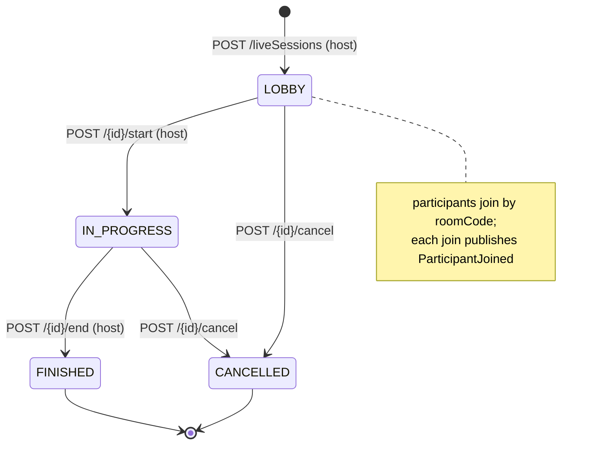
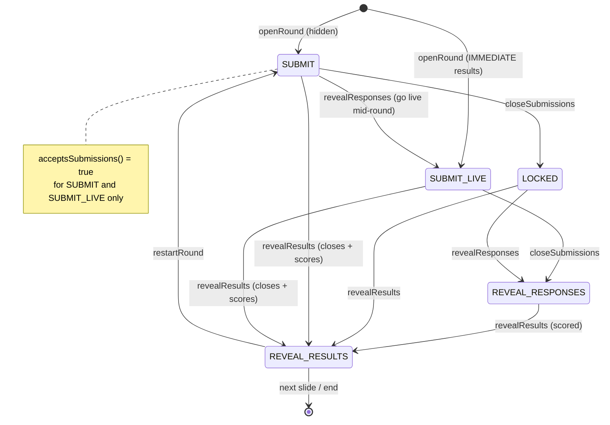
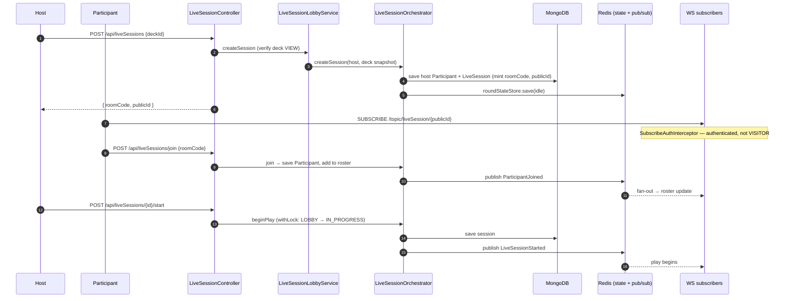
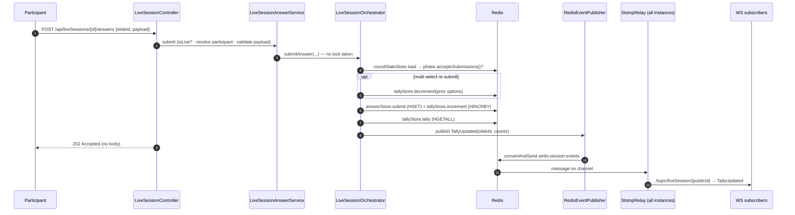
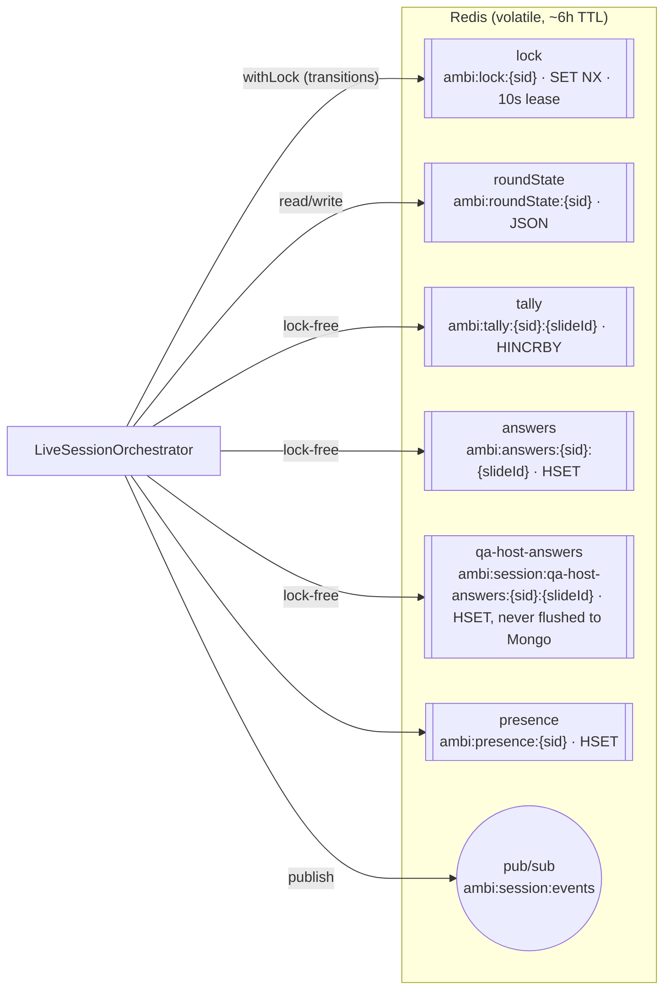

# Live Session

Real-time interactive play of a deck. A `LiveSession` snapshots the deck at
creation; **durable identity/roster live in MongoDB** while **volatile round
state lives in Redis**. Every state transition publishes a `SessionEvent` that
fans out over one Redis pub/sub channel and is relayed to STOMP subscribers.

> The transport & Redis-store architecture and the `startRound` publish
> sequence are documented in [live-session-flow.md](../live-session-flow.md) —
> this page adds the lifecycle/phase state machines and the join & answer
> sequences. Open questions: [live-session-open-decisions.md](../live-session-open-decisions.md).

Key classes: `LiveSessionController`, `LiveSessionLobbyService`,
`LiveSessionAnswerService`, `LiveSessionOrchestrator`, `SessionLocks`,
`TallyStore`, `AnswerStore`, `LiveRoundStateStore`, `PresenceStore`,
`QAndAHostAnswerStore`, `RedisEventPublisher`, `LiveSessionStompRelay`,
`SubscribeAuthInterceptor`.

## Session lifecycle

## Round phase state machine

Per-round phase governs whether submissions are accepted and what viewers see.
Held in Redis `LiveRoundState`; transitions run under the session lock.

## Create → join → start

## Answer submission — lock-free tally

Submissions deliberately skip the session lock; tallies use atomic Redis
`HINCRBY`. The HTTP call returns `202 Accepted` and the updated tally arrives via
WebSocket.

## Redis stores at runtime

## Event catalog

| Event | Trigger | Locked? |
|---|---|---|
| `LiveSessionStarted` | host starts | yes |
| `ParticipantJoined` / `Left` / `Reconnected` / `Removed` | roster change | yes |
| `PresenceChanged` | heartbeat / socket | no |
| `RoundStarted` | round opens (hidden) | yes |
| `LiveResultsShown` | opened live / mid-round go-live | yes |
| `TallyUpdated` | answer submitted | **no** |
| `QAndAUpdated` | Q&A question asked, or host answered/cleared one | **no** |
| `SubmissionsLocked` | submissions closed (hidden) | yes |
| `ResponsesRevealed` | responses shown | yes |
| `ResultsRevealed` | scored reveal | yes |
| `RoundRestarted` | round restarted | yes |
| `LiveSessionEnded` / `Cancelled` | session terminal | yes |
