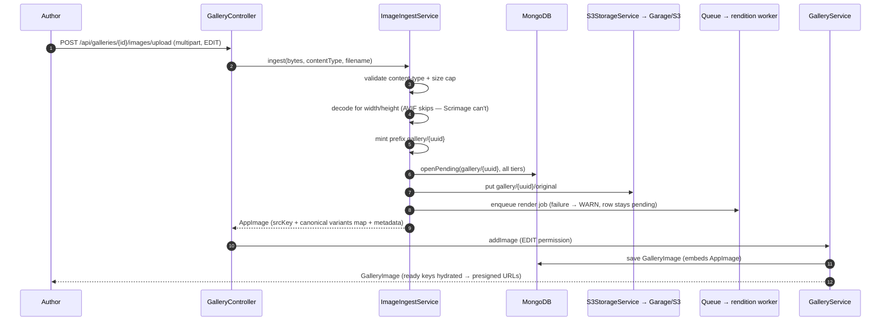
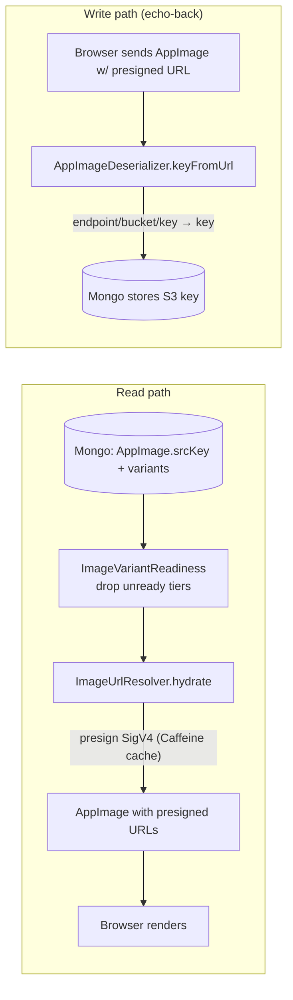
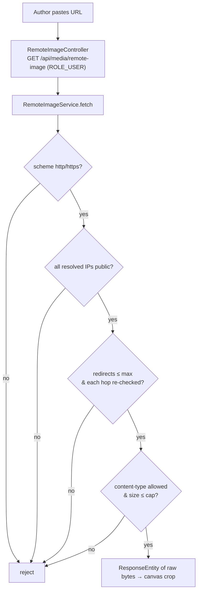
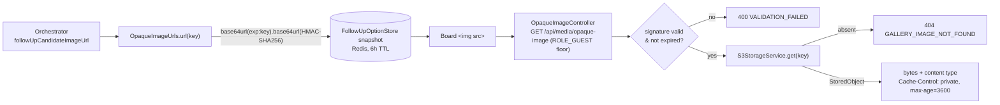
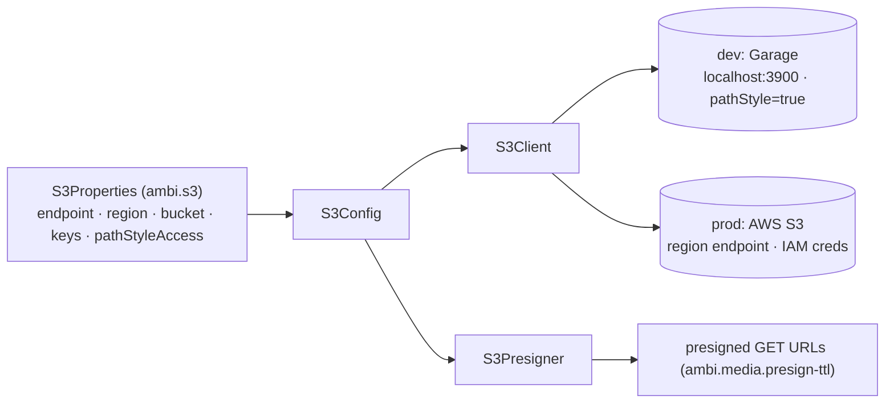

# Media & Gallery

Image ingest, storage, and delivery. Originals are stored in Garage/S3 under a
content-addressed prefix and five WebP renditions are rendered out of process;
MongoDB holds only S3 keys, and reads are hydrated into short-lived presigned
URLs.

Entry points: `GalleryController`, `ImageIngestService`, `S3StorageService`,
`ImageUrlResolver`. Data shapes: [Domain Model — Media](domain-model.md#media).

## Upload & rendition pipeline



Validation and the decode both run before anything is stored or enqueued, so a
rejected upload leaves no objects behind and never becomes a job the worker can
only fail.

The pending row is opened **before** the PUT and the job published **after** it:
no reader can observe the key root without a row saying which tiers are missing,
and the worker cannot dequeue before there is a source to render. The returned
`variants` map is the canonical key layout, not a claim that any rendition
exists — [Image Variants](../features/image-variants/README.md) owns that model,
the job/callback contracts, and the failure modes.

`ingest` has a prefix-parameterized overload for flows needing their own key
namespace and ownership scoping: live-session
[drawing](../features/drawing-slide/README.md#live-session--draw-and-submit)
answers under `drawing/{sessionId}/{participantId}/{uuid}`, and deck uploads
under `deck/{deckId}/` ([below](#placement-only-ingest)). The 3-arg overload
shown above is this one with the prefix defaulted to `gallery/{uuid}`.

## Read hydration — keys to presigned URLs

The S3 key is the source of truth; URLs are never persisted. On read, tiers that
are not rendered yet are filtered out, then the remaining keys are rewritten to
presigned GET URLs (cached in Caffeine until near expiry). When the client echoes
a URL back on write, the deserializer inverts it to the key.



The same filter runs on `displayKey` (and so `displayUrl`), which the opaque
proxy and the live-session board views use — they never run the `AppImage`
serializer, so hydration alone would leave them handing out URLs to objects that
aren't there. When nothing survives the filter, the untouched original is the
rendition. See [Image Variants](../features/image-variants/README.md).

## Byte-serving routes

Three routes return raw bytes rather than JSON. All three are `@Hidden` from
OpenAPI for the same reason: raw bytes are not a typed resource, so a generated
RTK Query hook could only mis-parse them.

### Remote image proxy (SSRF-guarded)

Authors can paste an external URL; the server fetches it (never the browser).



The proxy terminates there — it streams bytes back for client-side cropping.
Ingestion happens later via a separate `POST /api/galleries/{id}/images/upload`.

### Same-origin file read — re-cropping an owned image

`GET /api/galleries/{id}/images/{imageId}/file` (`GalleryService.getImageFile`,
deck VIEW) streams a gallery image's stored original from our own origin so the
browser can draw an image the user already owns onto a canvas and crop it.
Neither other route can serve that: presigned URLs point at the storage endpoint,
which is cross-origin and sends no CORS headers (render-only, canvas-tainting),
and the remote proxy **rejects** those URLs by design — blocking internal hosts
is what its SSRF guards are for.

An external image or a missing object is `404 GALLERY_IMAGE_NOT_FOUND`;
otherwise the bytes come back with their stored content type and
`Cache-Control: private, max-age=300`, since they are per-user authorized. The
frontend reads it with a plain authenticated `fetch` → `Blob`
(`fetchGalleryImageFile` in `shared/utils/imageEditing.ts`). Where the crop
lands from there depends on the caller: a picker opened with a deck id uploads
it deck-scoped via the [placement-only ingest](#placement-only-ingest) below
and mints no gallery entry; the handful of surfaces with no deck to scope to
still upload it as a new gallery image. See
[Image Cropping](../features/image-cropping.md) for the full flow.

### Opaque image proxy — URLs that hide their key

`GET /api/media/opaque-image?t={token}` streams an object addressed by a signed
token instead of by anything the client can read. A presigned URL is path-style,
so it spells its key out — `…/drawing/{sessionId}/…` for a live submission,
`…/gallery/{uuid}/…` for an authored image. A
[`SPOT_THE_ANSWER` follow-up board](../features/follow-up-slides/README.md#modes)
mixes the two on purpose, so the URL would name the seeded answer to anyone
reading devtools. Proxying only the seed would recreate the tell, so **every**
candidate image on a follow-up board is served this way.



- **Token** — HMAC-SHA256 under `ambi.media.opaque-token-secret`, compared in
  constant time. `OpaqueImageUrls` refuses to start on an unset or
  shorter-than-32-character secret, so tokens are never forgeable by default.
- **TTL** — `opaque-token-ttl` is 6h, matching the Redis round-snapshot TTL these
  URLs freeze into. The 1h presign TTL is shorter, so a snapshot of presigned
  URLs would go dead mid-round; this one cannot.
- **Reachability** — permitted at the same `hasRole("GUEST")` floor as the
  live-session player commands. The token authorizes the single object behind it;
  the floor only keeps anonymous visitors out.
- **Absolute** — minted against `ambi.media.public-base-url` (blank ⇒
  root-relative, for a single-origin deployment). Unlike the other two byte routes
  this one needs no `fetch` wrapper — the URL goes straight into an ``.

Ordinary reads keep presigning: this path costs a proxied read through our own
origin and is only worth it where the **key namespace itself** is confidential.

## Deletion

`DELETE /api/galleries/{id}/images/{imageId}` (EDIT) collects
`ImageKeys.allKeys(image)` — original plus every variant — deletes them from S3
(batched, idempotent), then removes the `GalleryImage` document. Deleting a whole
gallery does the same in the same order for every image before dropping the
`Gallery`. `S3StorageService.delete` chunks at S3's 1000-key `DeleteObjects` cap,
so a gallery of any size deletes cleanly.

Deck placements survive either delete because a deck owns its own copies
(below); `ThemeSpec` and `Avatar` embed the *same* keys, so those placements do
go blank.

## Deck image ownership (copy-on-select)

Placing a gallery image into a deck **adopts** it: `DeckImageLifecycleService`
server-side-copies the original and every variant into a fresh
`deck/{deckId}/{uuid}` prefix and rewrites the embedded `AppImage` before the
deck is saved, so deleting the source gallery image can never blank the deck.
External images are never adopted, and an image already under this deck's prefix
is left alone. `DeckImages` walks every image-bearing slot in a `Deck` and is
what the lifecycle service diffs before/after a save.

Adoption is the second place a key root is minted, so it carries the same
readiness obligation as ingest: a source tier that wasn't there to copy is
missing under the new prefix too, and only the copies that landed are recorded.
See [Image Variants](../features/image-variants/README.md).

```mermaid
sequenceDiagram
    autonumber
    participant DS as DeckService
    participant DIL as DeckImageLifecycleService
    participant S3 as S3StorageService
    participant M as MongoDB

    DS->>DS: beforeKeys = DeckImages.keys(deck)
    DS->>DS: apply the mutation in memory
    DS->>DIL: adoptImages(deck)
    loop every image not already under deck/{deckId}/
        DIL->>S3: copyIfExists(original + each variant)
        DIL->>DIL: rewrite srcKey + only the variants that copied
        DIL->>DIL: any that didn't → pending row + job for the new prefix
    end
    DS->>M: persist deck (save — @Version-guarded;<br/>promote paths use a targeted update instead)
    DS->>DIL: cleanupRemoved(deckId, beforeKeys, afterKeys)
    DIL->>S3: delete(removed keys, restricted to deck/{deckId}/) — best-effort
```

Every deck write that can place or remove an image runs an adopt → persist →
cleanup shape (the promote paths persist via a targeted update rather than a
versioned save), so slide deletion, option removal, an image replace or clear,
and the background promote paths all free their deck-owned bytes the same way;
deleting a deck wipes the whole `deck/{deckId}/` prefix. Ordering keeps
failures cheap — copies before the persist, deletes after and best-effort — so
either failure only orphans objects, never fails the request. There is no
orphan sweeper.

### Placement-only ingest

`POST /api/decks/{id}/images/upload` (multipart `file`, optional `altText`, deck
EDIT, `DeckController.uploadDeckImage`) ingests straight into the deck's
namespace and returns a bare `AppImage` (`201`) — **no `GalleryImage` is
created**. Same validation and renditions; only the owner differs. It exists for
bytes that are one slot's *content* rather than a library image: the
`GalleryPicker` crop step uploads through it whenever it was opened with a deck
id, so cropping the same source for ten slots leaves one gallery entry, not
ten — see [image-cropping](../features/image-cropping.md) for the full
frontend flow. The keys are already deck-scoped, so adoption is a no-op and
`cleanupRemoved` frees them when the placement is cleared.

### Migration for pre-existing decks

`DeckImageOwnershipMigration` (an `ApplicationRunner` gated on
`migrate.deckImages.run=true`, run via `scripts/migrate-deck-images.sh`)
adopts older decks. It walks the `decks` collection only — not the deck snapshots
embedded in `LiveSessions` — writes each deck back filtered on `_id` **and**
`version`, and is idempotent and `--dry-run`-able. Ship the code first: decks
touched afterwards self-heal on their next write.

## S3 client configuration


