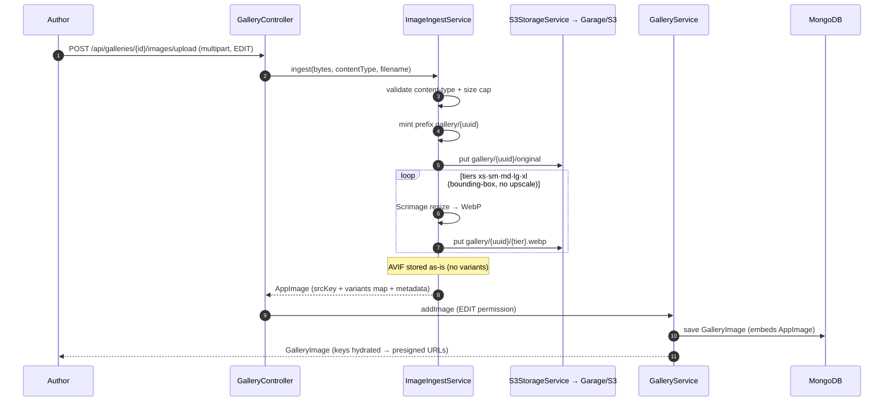
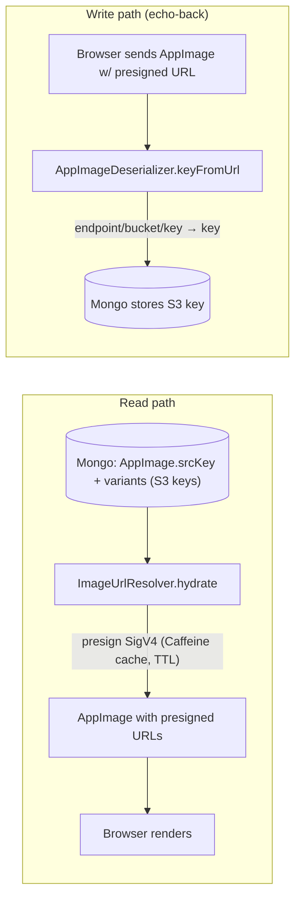
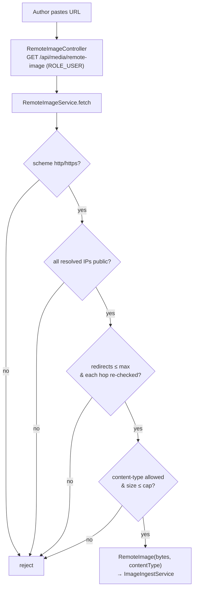
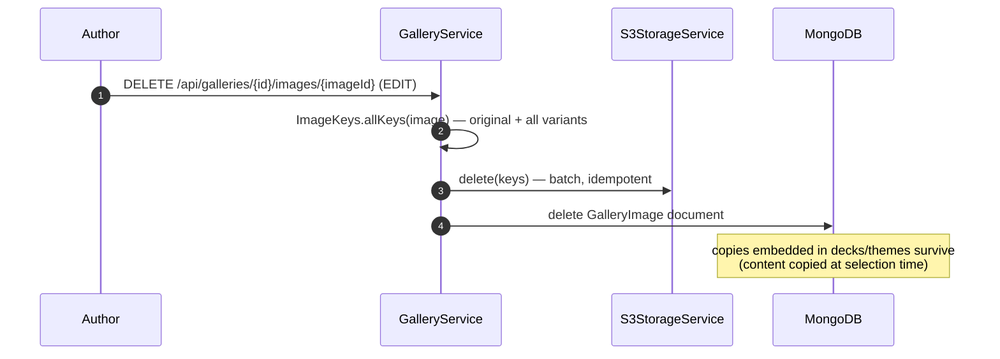
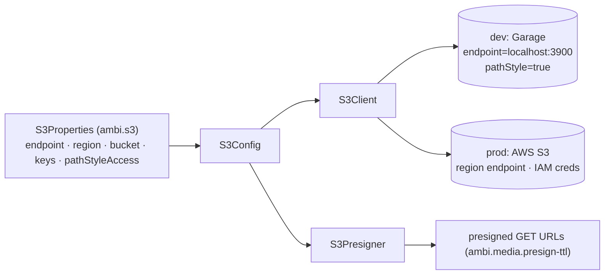

# Media & Gallery

Image ingest, storage, and delivery. Originals plus five WebP renditions are
stored in Garage/S3 under a content-addressed prefix; MongoDB holds only S3
keys, and reads are hydrated into short-lived presigned URLs.

Key classes: `GalleryController`, `RemoteImageController`, `GalleryService`,
`ImageIngestService`, `S3StorageService`, `S3Config`, `ImageUrlResolver`,
`AppImageDeserializer`, `RemoteImageService`. Data shapes:
[Domain Model — Media](domain-model.md#media). Infra:
[infrastructure.md](../infrastructure/infrastructure.md).

## Upload & rendition pipeline

`ImageIngestService.ingest` also has a prefix-parameterized overload used by
non-gallery flows that need their own key namespace and ownership scoping:
live-session [Drawing](../features/drawing-slide/README.md#live-session--draw-and-submit)
answer uploads key their objects under `drawing/{sessionId}/{participantId}/{uuid}`
(sibling to `gallery/{uuid}`, minted by `LiveSessionAnswerService.storeDrawing`)
so answer validation can check a submitted image is one this participant
uploaded through this session, and a resubmit's delete can target exactly its
own objects. The 3-arg overload (gallery uploads, shown above) is just this
one with the prefix defaulted to `gallery/` + a fresh UUID.

## Read hydration — keys to presigned URLs

The S3 key is the source of truth; URLs are never persisted. On read, keys are
rewritten to presigned GET URLs (cached in Caffeine until near expiry). When the
client echoes a URL back on write, the deserializer inverts it to the key.

## Remote image proxy (SSRF-guarded)

Authors can paste an external URL; the server fetches it (never the browser),
guarding against SSRF before the bytes enter the ingest pipeline.

## Deletion

## S3 client configuration

