# Backend Model Diagram

Class diagram of all types in `backend/src/main/java/cephadex/brainflex/model/` (root + `enums/`, `element/`, `element/block/`, `element/parts/`, `answer/`, `image/`).

Three sealed hierarchies anchor the model — `DeckElement` (13 question/slide variants), `AnswerPayload` (12 answer types), and `SlideBlock` (5 block types) — with `ElementChrome` factoring out shared question metadata. `Auditable` is the common base for ~12 root `@Document` classes; `UserSnapshot` and `StoredImageVariant` are the workhorse embedded value objects used to denormalize across collections.

```mermaid
classDiagram
    direction LR

    %% ====================================================
    %% BASE
    %% ====================================================
    class Auditable {
        <<abstract>>
        Instant createdAt
        Instant updatedAt
    }

    %% ====================================================
    %% USER / AUTH
    %% ====================================================
    class User {
        <<@Document>>
        String id
        String email
        UserRole role
    }
    class UserSnapshot { <<record>> }
    class PublicUserSnapshot { <<record>> }
    class NotificationPrefs
    class PlayerStats
    class Membership
    class BillingState

    Auditable <|-- User
    User --> NotificationPrefs : prefs
    User --> PlayerStats : stats
    User --> Membership : membership
    Membership --> BillingState : billing

    %% ====================================================
    %% ORGANIZATION
    %% ====================================================
    class Organization { <<@Document>> }
    class OrganizationPlan

    Auditable <|-- Organization
    Organization --> OrganizationPlan : plan
    Organization --> StoredImageVariant : logo
    OrganizationPlan --> BillingState : billing

    %% ====================================================
    %% DECK / CONTENT
    %% ====================================================
    class Deck {
        <<@Document>>
        DeckVisibility visibility
        PublishStatus publishStatus
        Difficulty difficulty
        License license
    }
    class PlayableContent {
        <<embedded>>
        SessionFormat format
        ShowResponsesMode showResponses
    }
    class Tag { <<@Document>> }
    class DeckFavorite { <<@Document>> }
    class DeckRating { <<@Document>> }
    class DeckComment { <<@Document>> }
    class DeckCollaborator {
        <<@Document>>
        CollaboratorRole role
    }
    class DeckCollection {
        <<@Document>>
        DeckVisibility visibility
    }
    class DeckAnalytics { <<@Document>> }
    class ElementStats
    class FormatRollup

    Auditable <|-- Deck
    Auditable <|-- Tag
    Auditable <|-- DeckRating
    Auditable <|-- DeckComment
    Auditable <|-- DeckCollection
    Auditable <|-- DeckAnalytics
    Deck --> PlayableContent : content
    PlayableContent --> InteractiveSessionSettings : settings
    PlayableContent --> Image : cover
    PlayableContent --> Image : background
    PlayableContent --> DeckElement : elements*
    DeckComment --> UserSnapshot : author
    DeckAnalytics --> ElementStats : perElement*
    DeckAnalytics --> FormatRollup : rollups*

    %% ====================================================
    %% DECKELEMENT SEALED HIERARCHY
    %% ====================================================
    class DeckElement {
        <<sealed interface>>
        String id()
        ElementKind kind()
        ElementChrome chrome()
    }
    class ElementChrome {
        <<record>>
        ScoringStrategy bestAnswerScoring
        ResponseMode responseMode
        MediaPosition mediaPosition
    }
    class Slide {
        <<record>>
        SlideKind slideKind
        ResultsDisplayType resultsDisplayType
        JoinType joinType
        ShowResponsesMode showResponses
    }
    class McqQuestion { <<record>> }
    class TextQuestion { <<record>> }
    class NumberQuestion { <<record>> }
    class RankingQuestion {
        <<record>>
        ScoringStrategy scoring
    }
    class ScalesQuestion { <<record>> }
    class QAndAQuestion { <<record>> }
    class GridQuestion { <<record>> }
    class PlaceOnImageQuestion {
        <<record>>
        ScoringStrategy scoring
    }
    class WordCloudQuestion { <<record>> }
    class AllocationQuestion { <<record>> }
    class MatchingQuestion {
        <<record>>
        ScoringStrategy scoring
    }
    class DrawingQuestion { <<record>> }

    DeckElement <|.. Slide
    DeckElement <|.. McqQuestion
    DeckElement <|.. TextQuestion
    DeckElement <|.. NumberQuestion
    DeckElement <|.. RankingQuestion
    DeckElement <|.. ScalesQuestion
    DeckElement <|.. QAndAQuestion
    DeckElement <|.. GridQuestion
    DeckElement <|.. PlaceOnImageQuestion
    DeckElement <|.. WordCloudQuestion
    DeckElement <|.. AllocationQuestion
    DeckElement <|.. MatchingQuestion
    DeckElement <|.. DrawingQuestion
    DeckElement --> ElementChrome : chrome
    ElementChrome --> Image : background
    ElementChrome --> Image : image

    %% ====================================================
    %% ELEMENT PARTS
    %% ====================================================
    class McqOption { <<record>> }
    class RankingItem { <<record>> }
    class ScaleStatement { <<record>> }
    class MatchingPair { <<record>> }
    class GridCellsConfig { <<record>> }

    McqQuestion --> McqOption : options*
    AllocationQuestion --> McqOption : options*
    RankingQuestion --> RankingItem : items*
    ScalesQuestion --> ScaleStatement : statements*
    MatchingQuestion --> MatchingPair : pairs*
    GridQuestion --> GridCellsConfig : cells
    PlaceOnImageQuestion --> Image : targetImage
    DrawingQuestion --> Image : backingImage
    McqOption ..|> ImageContainer
    RankingItem ..|> ImageContainer
    MatchingPair ..|> ImageContainer
    GridCellsConfig ..|> ImageContainer

    %% ====================================================
    %% SLIDEBLOCK SEALED HIERARCHY
    %% ====================================================
    class SlideBlock {
        <<sealed interface>>
        SlideBlockKind kind()
    }
    class HeadingBlock { <<record>> }
    class BodyBlock { <<record>> }
    class BulletListBlock { <<record>> }
    class ImageBlock { <<record>> }
    class CalloutBlock {
        <<record>>
        CalloutTone tone
    }

    SlideBlock <|.. HeadingBlock
    SlideBlock <|.. BodyBlock
    SlideBlock <|.. BulletListBlock
    SlideBlock <|.. ImageBlock
    SlideBlock <|.. CalloutBlock
    Slide --> SlideBlock : blocks*
    ImageBlock --> Image : image
    ImageBlock ..|> ImageContainer

    %% ====================================================
    %% INTERACTIVE SESSION / GAMEPLAY
    %% ====================================================
    class InteractiveSession {
        <<@Document>>
        SessionLifecycle status
        RoundPhase phase
    }
    class InteractiveSessionSettings {
        <<embedded>>
        AnswerSubmissionMode answerSubmissionMode
        ShowResponsesMode showResponses
    }
    class InteractiveSessionPlayer
    class PlayerAnswer
    class RoundVote
    class Team
    class PlayerEndStats { <<record>> }

    Auditable <|-- InteractiveSession
    InteractiveSession --> PlayableContent : content
    InteractiveSession --> InteractiveSessionPlayer : players*
    InteractiveSession --> Team : teams*
    InteractiveSessionPlayer --> UserSnapshot : user
    InteractiveSessionPlayer --> PlayerAnswer : answers*
    InteractiveSessionPlayer --> RoundVote : votes*
    InteractiveSessionPlayer --> PlayerEndStats : endStats
    PlayerAnswer --> AnswerPayload : payload

    %% ====================================================
    %% ANSWERPAYLOAD SEALED HIERARCHY
    %% ====================================================
    class AnswerPayload {
        <<sealed interface>>
    }
    class McqAnswer { <<record>> }
    class TextAnswer { <<record>> }
    class NumberAnswer { <<record>> }
    class RankingAnswer { <<record>> }
    class ScalesAnswer { <<record>> }
    class GridAnswer { <<record>> }
    class PlaceOnImageAnswer { <<record>> }
    class WordCloudAnswer { <<record>> }
    class AllocationAnswer { <<record>> }
    class MatchingAnswer { <<record>> }
    class DrawingAnswer { <<record>> }
    class TimeoutAnswer { <<record>> }
    class Stroke { <<record>> }

    AnswerPayload <|.. McqAnswer
    AnswerPayload <|.. TextAnswer
    AnswerPayload <|.. NumberAnswer
    AnswerPayload <|.. RankingAnswer
    AnswerPayload <|.. ScalesAnswer
    AnswerPayload <|.. GridAnswer
    AnswerPayload <|.. PlaceOnImageAnswer
    AnswerPayload <|.. WordCloudAnswer
    AnswerPayload <|.. AllocationAnswer
    AnswerPayload <|.. MatchingAnswer
    AnswerPayload <|.. DrawingAnswer
    AnswerPayload <|.. TimeoutAnswer
    DrawingAnswer --> Stroke : strokes*

    %% ====================================================
    %% SESSION SATELLITES
    %% ====================================================
    class GameHistoryEntry { <<@Document>> }
    class InteractiveSessionChatMessage { <<@Document>> }
    class InteractiveSessionResult { <<@Document>> }
    class PlayerPlacement
    class InteractiveSessionInvite { <<@Document>> }
    class ScheduledInteractiveSession {
        <<@Document>>
        ScheduleStatus status
    }
    class AudienceSubmission {
        <<@Document>>
        SubmissionModeration moderation
    }
    class Reaction { <<@Document>> }

    Auditable <|-- ScheduledInteractiveSession
    GameHistoryEntry --> UserSnapshot : user
    GameHistoryEntry --> PlayerEndStats : endStats
    InteractiveSessionChatMessage --> UserSnapshot : author
    InteractiveSessionResult --> PlayerPlacement : placements*
    PlayerPlacement --> UserSnapshot : user
    PlayerPlacement --> PlayerEndStats : endStats
    AudienceSubmission --> UserSnapshot : submitter
    Reaction --> UserSnapshot : sender
    ScheduledInteractiveSession --> InteractiveSessionSettings : settings

    %% ====================================================
    %% ACHIEVEMENTS / NOTIFICATIONS
    %% ====================================================
    class Achievement {
        <<@Document>>
        AchievementTrigger trigger
    }
    class UserAchievement { <<@Document>> }
    class Notification {
        <<@Document>>
        NotificationKind kind
    }
    class EmailSuppression { <<@Document>> }

    Auditable <|-- Achievement
    Auditable <|-- EmailSuppression
    Notification --> UserSnapshot : actor

    %% ====================================================
    %% IMAGES / MEDIA
    %% ====================================================
    class Image { <<record>> }
    class ImageVariant { <<record>> }
    class ImageSize {
        <<enum>>
        XS SM MD LG XL
    }
    class ImageContainer { <<interface>> }
    class StoredImageVariant { <<record>> }
    class GalleryImage { <<@Document>> }
    class MediaAsset {
        <<@Document>>
        MediaKind kind
    }
    class Theme {
        <<@Document>>
        ThemeMode mode
    }

    Auditable <|-- GalleryImage
    Auditable <|-- MediaAsset
    Auditable <|-- Theme
    Image --> ImageVariant : variants*
    ImageVariant --> ImageSize
    StoredImageVariant --> ImageSize
    GalleryImage --> StoredImageVariant : variants*
    MediaAsset --> StoredImageVariant : variants*
    Theme --> StoredImageVariant : assets*

    %% ====================================================
    %% NOTABLE ENUMS (selection)
    %% ====================================================
    class ElementKind {
        <<enum>>
        SLIDE MCQ TEXT NUMBER RANKING
        SCALES Q_AND_A GRID PLACE_ON_IMAGE
        WORD_CLOUD ALLOCATION MATCHING DRAWING
    }
    class ScoringStrategy {
        <<enum>>
        EXACT PARTIAL BINARY LINEAR
        ALL_OR_NOTHING POINTS_PER_VOTE FLAT_WINNER
    }
    class UserRole { <<enum>> }
    class DeckVisibility { <<enum>> }
    class SessionLifecycle { <<enum>> }
    class RoundPhase { <<enum>> }
```

