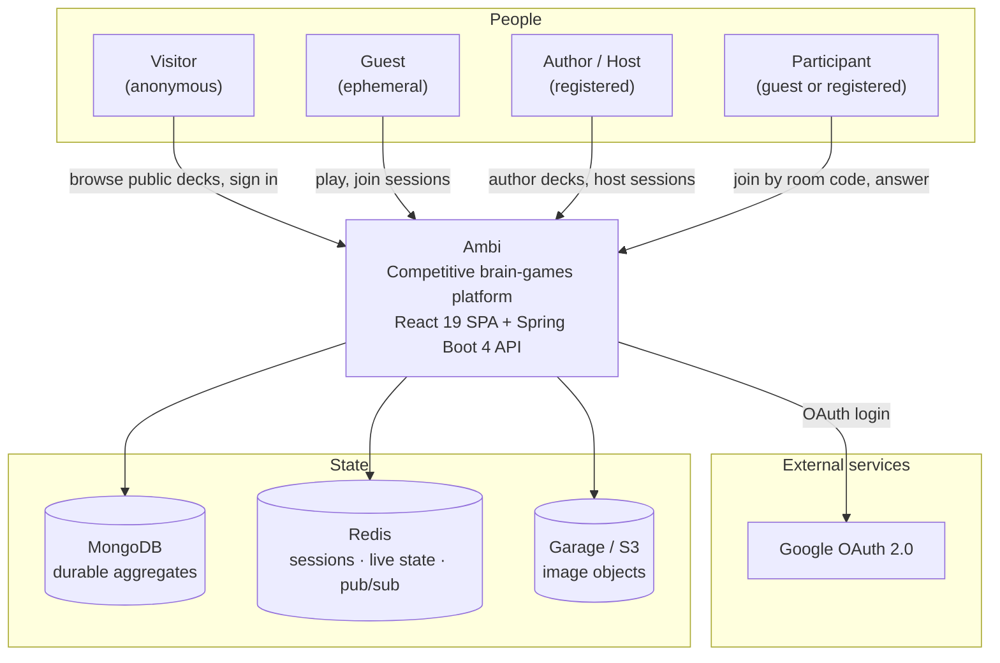
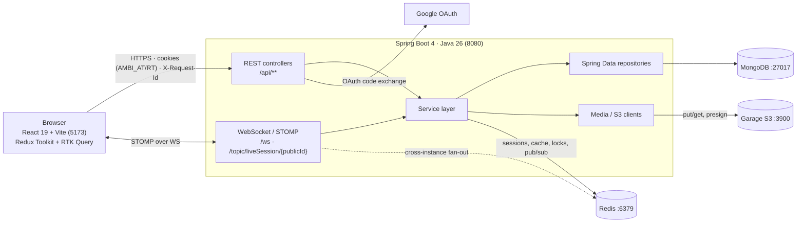
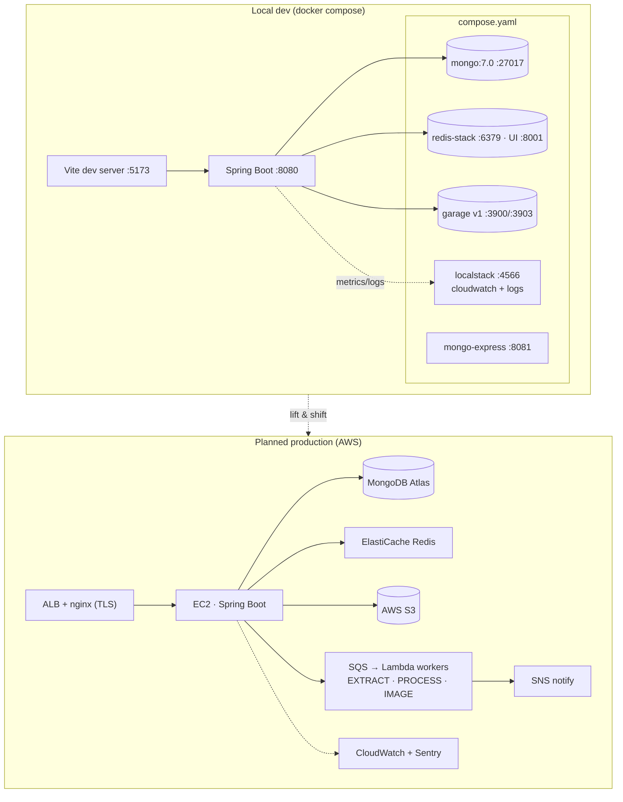
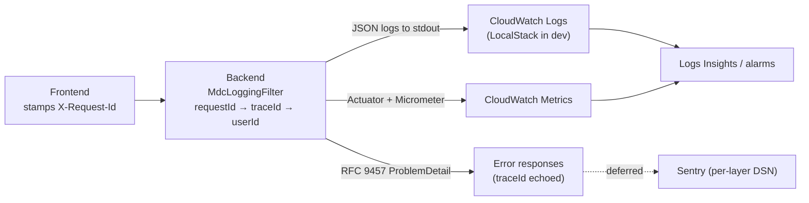

# System Overview

High-altitude view of Ambi: who uses it, what runs, and where state lives.
Zoom into a specific feature via the [diagrams index](README.md).

- Backend layering per feature: [Deck Authoring](deck-authoring.md), [Live Session](live-session.md), [Media & Gallery](media-gallery.md).
- Data shapes: [Domain Model (ERD)](domain-model.md).
- Deeper infra prose: [infrastructure.md](../infrastructure/infrastructure.md) and [ADR 001 — Observability](../decisions/001-observability-stack.md).

## Context — actors & systems

## Containers — what talks to what

## Deployment topology

Local dev today; AWS is the planned production target (see
[infrastructure.md](../infrastructure/infrastructure.md)).

## Observability path

Vendor-agnostic foundation is implemented; error-tracking vendors (Sentry) are
deferred. See [ADR 001](../decisions/001-observability-stack.md).

