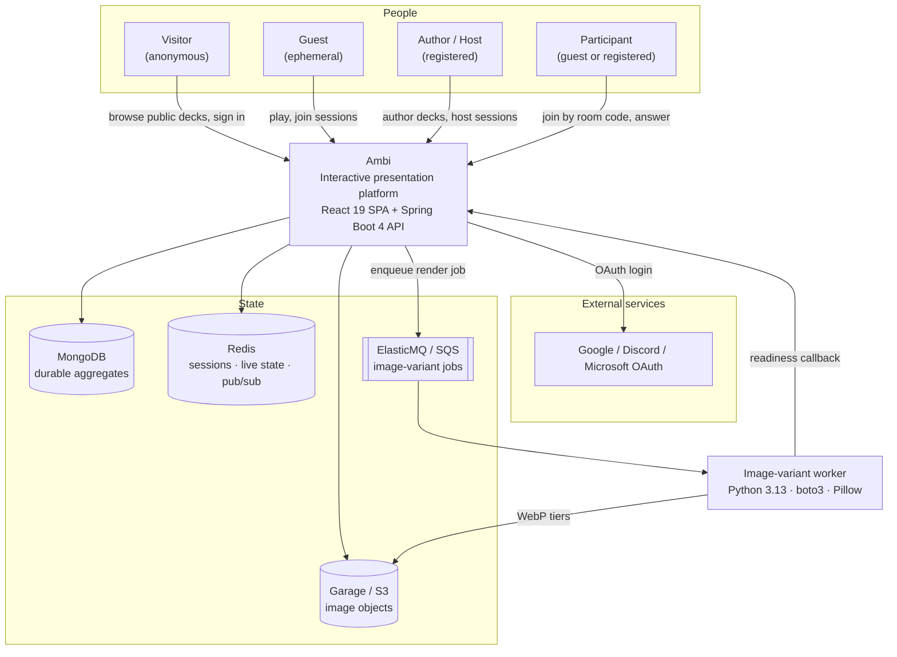
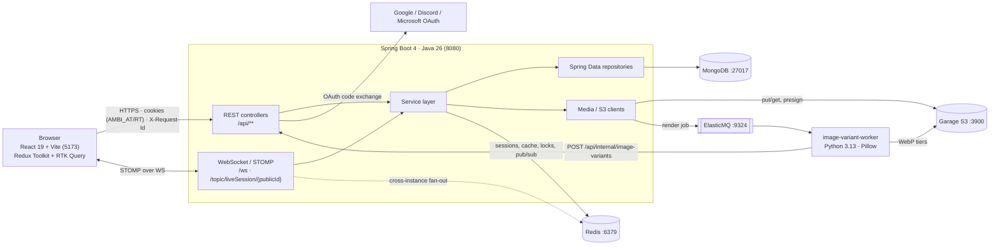

# System Overview

High-altitude view of Ambi: who uses it, what runs, and where state lives.
Zoom into a specific feature via the [diagrams index](README.md).

- Backend layering per feature: [Deck Authoring](deck-authoring.md), [Live Session](live-session.md), [Media & Gallery](media-gallery.md).
- Data shapes: [Domain Model (ERD)](domain-model.md).
- Deeper infra prose: [infrastructure.md](../infrastructure/infrastructure.md) and [ADR 001 — Observability](../decisions/001-observability-stack.md).

## Context — actors & systems

## Containers — what talks to what

### The stack in that picture

| Layer | Tools |
| --- | --- |
| Frontend | React 19 (React Compiler) · TypeScript strict · Vite · TanStack Router (file-based) · Redux Toolkit + RTK Query · CSS Modules + `tokens.css` · TipTap · `vite-plugin-svgr` |
| Backend | Java 26 · Spring Boot 4 · Maven (`./mvnw`) · Spring Data MongoDB · Redis · Spring Security + OAuth2 · SpringDoc OpenAPI · Lombok · AWS SDK v2 (S3 + SQS) |
| Image-variant worker | Python 3.13 · boto3 · Pillow — out of process, deployable as a poller container or a Lambda ([README](../../worker/README.md), [feature doc](../features/image-variants/README.md)) |

The API client, validation bounds, and enums are **generated** from the backend
OpenAPI schema — never hand-edited. Backend package `com.cephadex.ambi` is
feature-based (`auth/`, `billing/`, `common/`, `config/`, `media/`, `org/`,
`presentation/`, `session/`, `theme/`, `user/`), each with its own
`controller/`/`service/`/`dto/`/`enums/` — there are no flat layer packages.
Endpoints are prefixed `/api` and documented at
`http://localhost:8080/swagger-ui/`; CORS allows only `http://localhost:5173`,
with credentials. Conventions: [frontend-rules](../rules/frontend-rules.md),
[backend-rules](../rules/backend-rules.md),
[styling-rules](../rules/styling-rules.md).

Deployment is local-only today — see
[infrastructure.md](../infrastructure/infrastructure.md) for the container set
and [ADR 001](../decisions/001-observability-stack.md) for the logging/metrics
plan.
