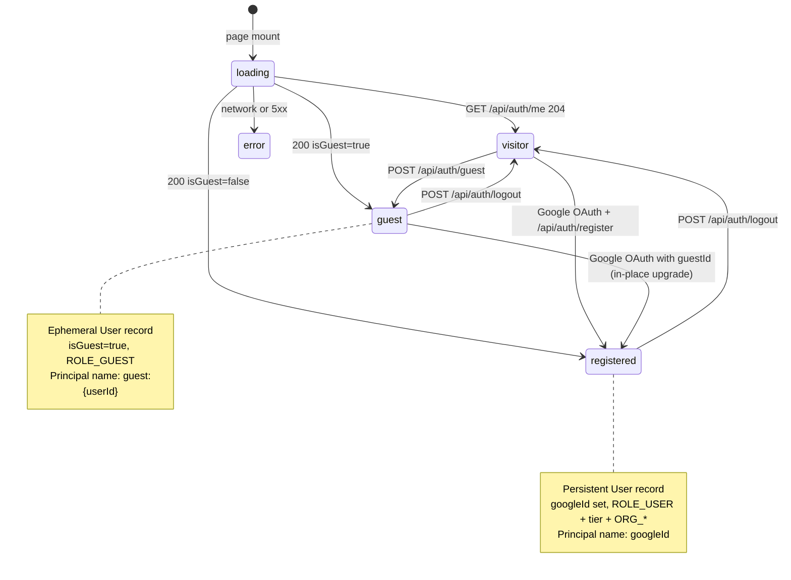
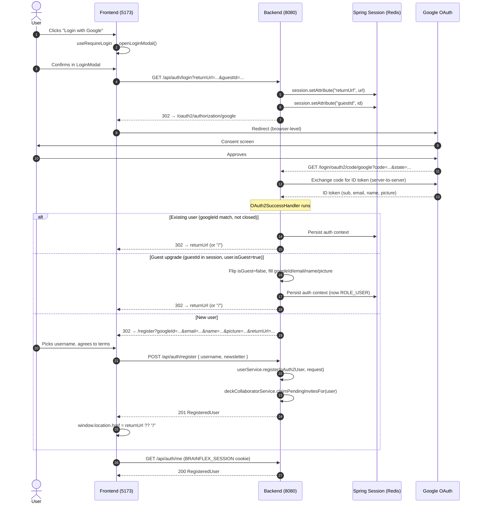
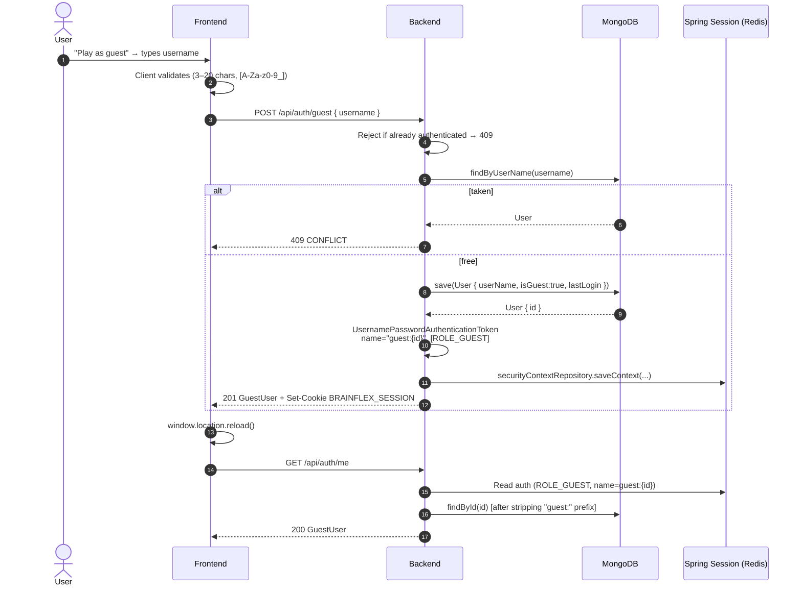
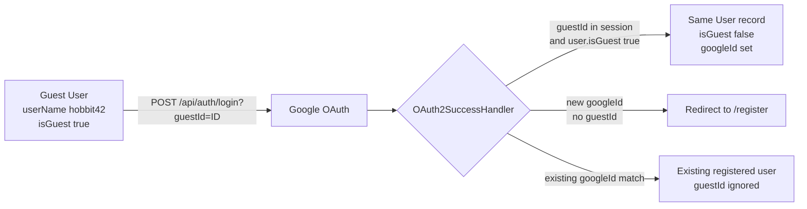
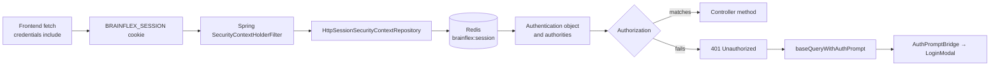

# Auth

Google OAuth 2.0 + guest sessions, with Spring Session backed by Redis and a
cookie-based session shared between frontend and backend. The goal of this doc
is to map the moving parts so a new contributor can answer:

- _Who is the current user?_ (identity model)
- _How do they sign in?_ (OAuth, guest, guest→registered upgrade)
- _How does the frontend find out?_ (`useCurrentUser`, `useRequireLogin`)
- _How are protected resources gated?_ (Spring roles, the `_authenticated`
  route layout, and page-/action-level checks)

For details on the **TanStack Router `_authenticated` route gate** — what it
covers, why it co-exists with the 401 bridge and `useRequireLogin`, and how
to add a new gated route — see [route-protection.md](route-protection.md).

## Related

- [Membership feature](../membership/README.md) — tier/role mapping that turns a
  `User` into a Spring authority set.
- [Infrastructure overview](../../infrastructure/README.md) — Redis session
  store config.

---

## Identity model

Every request resolves to one of three identity states. The frontend hook
`useCurrentUser()` (`frontend/src/hooks/useCurrentUser.ts`) returns this state
machine directly:



### State details

| State        | Session cookie | Spring `Authentication`                       | Authorities                                            |
| ------------ | -------------- | --------------------------------------------- | ------------------------------------------------------ |
| `visitor`    | absent         | `anonymousUser`                               | none                                                   |
| `guest`      | present        | `UsernamePasswordAuthenticationToken`         | `ROLE_GUEST`                                           |
| `registered` | present        | `OAuth2AuthenticationToken` (Google provider) | `ROLE_USER` + tier role + `ROLE_ORG_*` per membership  |

The `RegisteredUser` and `GuestUser` DTOs are intentionally narrow — guests
expose only `id`, `userName`, `pictureUrl`, `picture`, `stats`. Email,
`googleId`, `organizationIds`, `activeThemeId`, and `membership` are
registered-only fields.

### Role hierarchy

`SecurityConfig.java` registers a `RoleHierarchyImpl`:

```
ROLE_USER_PREMIUM > ROLE_USER_BASIC
ROLE_USER_BASIC   > ROLE_USER_FREE
ROLE_USER_FREE    > ROLE_USER
ROLE_ORG_OWNER    > ROLE_ORG_MEMBER
```

So a `@PreAuthorize("hasRole('USER_BASIC')")` accepts BASIC or PREMIUM, and
`hasRole('ORG_MEMBER')` accepts owners too. Lapsed membership payments
(`PAST_DUE`, `CANCELED`, `EXPIRED`, `NONE`) collapse to `ROLE_USER_FREE`
regardless of nominal tier — see `AuthoritiesService.tierRole`.

---

## OAuth sign-in flow



### What's preserved across the redirect chain

- `returnUrl` — stashed in the session at `/api/auth/login`, read by
  `OAuth2SuccessHandler` after the Google round-trip, then removed. For
  brand-new users it's re-encoded into the `/register?returnUrl=…` query
  string so the registration form can navigate there on success.
- `guestId` — same lifecycle. Triggers the in-place guest→registered upgrade
  branch instead of the new-user redirect.

---

## Guest session flow

Guests skip Google entirely. The backend creates a minimal `User` record and
saves a `UsernamePasswordAuthenticationToken` straight into the Redis-backed
session.



### Guest → registered upgrade

Same as the OAuth flow above, but the LoginModal passes the current
`guestId` to `/api/auth/login`. The session stashes it, and after Google
returns, `OAuth2SuccessHandler` finds the guest `User` by id and **mutates it
in place** — `isGuest=false`, fills in `googleId/email/name/picture`. The
record's id is unchanged, so any decks or collaborator records pointing at
the guest user remain valid.



---

## Logout

```mermaid
sequenceDiagram
    actor U
    participant FE as Frontend
    participant BE as Backend
    participant SS as Redis

    U->>FE: Clicks Logout
    FE->>BE: POST /api/auth/logout (credentials include)
    BE->>SS: Invalidate session
    BE-->>FE: 200 OK + Set-Cookie BRAINFLEX_SESSION=; Max-Age=0
    FE->>FE: window.location.reload()
    FE->>BE: GET /api/auth/me
    BE-->>FE: 204 No Content → state visitor
```

`window.location.reload()` is intentional — it flushes all RTK Query caches
and rehydrates `useCurrentUser` from scratch, avoiding stale per-user data
sitting in the store.

---

## Request authorization

Every authenticated API call relies on the same path:



### Public vs protected routes

Public (declared in `SecurityConfig.java`):

- `OPTIONS /**` (CORS preflight)
- `/api/health`, `/api/public/**`, `/swagger-ui/**`, `/**/api-docs`,
  `/oauth2/**`, `/ws/**`
- `/api/auth/login`, `/api/auth/me`, `/api/auth/guest`
- `GET /api/users/leaderboard/**`, `GET /api/users/check-username`,
  `GET /api/interactive-sessions/**`, `GET /api/decks/**`, `GET /api/collections/*`

Everything else is `.authenticated()`. The exception handler returns a plain
`401` (no redirect), which the frontend's `baseQueryWithAuthPrompt`
intercepts.

### The 401 bridge

`frontend/src/store/emptyApi.ts` wraps the RTK Query base query:

- Any non-`/api/auth/me` request returning `401` emits an `authRequired`
  event.
- `AuthPromptBridge` (mounted once in `__root.tsx`) listens for that event
  and opens the `LoginModal`.

This is what makes session-expired errors mid-session "just work" — the user
gets a sign-in modal instead of a silent failure. It is **independent** of
the `_authenticated` route gate and is preserved on top of it — see
[route-protection.md](route-protection.md) for the layering.

### `useRequireLogin` (action-level gate)

For UI affordances that need auth (favoriting a deck, creating a game), the
hook returns a `requireLogin(fn)` wrapper:

```ts
const { requireLogin } = useRequireLogin();
const handleFavorite = requireLogin(() => favoriteDeck(deck.id));
// If unauthenticated, clicking opens LoginModal instead of calling favoriteDeck.
```

This is doing a different job from route protection: it lets a single
component support both states without page-level branching.

---

## Cookie + session config

| Property            | Value                                          | Where                                |
| ------------------- | ---------------------------------------------- | ------------------------------------ |
| Cookie name         | `BRAINFLEX_SESSION`                            | `SessionConfig.java`                 |
| Path                | `/`                                            | `SessionConfig.java`                 |
| HttpOnly            | `true`                                         | `SessionConfig.java`                 |
| SameSite            | `Lax` (preserves OAuth redirect from Google)   | `SessionConfig.java`                 |
| Secure              | auto-detected from `request.isSecure()`        | `SessionConfig.java`                 |
| Idle timeout        | 30 minutes (`maxInactiveIntervalInSeconds`)    | `SessionConfig.java`                 |
| Absolute timeout    | 14 days                                        | `application.properties`             |
| Storage             | Redis, namespace `brainflex:session`           | `SessionConfig.java`                 |
| Profile gate        | `@Profile("!test")` — tests use in-memory      | `SessionConfig.java`                 |
| CORS allowed origin | `http://localhost:5173` only                   | `SecurityConfig.java`                |
| CORS credentials    | `true` (required for cookie auth)              | `SecurityConfig.java`                |

The `Secure` cookie attribute is unset in code so that `localhost` dev gets
`Secure=false` and HTTPS deploys get `Secure=true` automatically. Don't
hard-code it.

---

## Key files

### Backend

| File                                                  | Purpose                                                                       |
| ----------------------------------------------------- | ----------------------------------------------------------------------------- |
| `backend/.../config/SecurityConfig.java`              | Filter chain, public routes, OAuth2 success handler, role hierarchy           |
| `backend/.../config/SessionConfig.java`               | `BRAINFLEX_SESSION` cookie attrs, Redis namespace, idle timeout               |
| `backend/.../controller/AuthController.java`          | `/api/auth/login`, `/me`, `/register`, `/logout`, `/guest`                    |
| `backend/.../service/UserService.java`                | `createGuest`, `register` (handles new + reopened closed accounts)            |
| `backend/.../service/AuthoritiesService.java`         | Role constants + `authoritiesFor(User)` mapping                               |
| `backend/.../service/DeckCollaboratorService.java`    | `claimPendingInvitesFor` — runs at registration to attach prior invites       |
| `backend/.../model/User.java`                         | `googleId`, `isGuest`, `isClosed`, `membership`, `organizationIds`            |
| `backend/.../dto/UserDTO.java`                        | Sealed interface: `GuestUser` / `RegisteredUser`                              |

### Frontend

| File                                                       | Purpose                                                            |
| ---------------------------------------------------------- | ------------------------------------------------------------------ |
| `frontend/src/hooks/useCurrentUser.ts`                     | `loading / visitor / guest / registered / error` state machine     |
| `frontend/src/hooks/useRequireLogin.tsx`                   | `requireLogin(fn)` wrapper + `openLoginModal()` for action gating  |
| `frontend/src/AppRouter.tsx`                               | Wraps `<RouterProvider>` with the typed `{ auth }` context         |
| `frontend/src/routes/__root.tsx`                           | Declares the router context type via `createRootRouteWithContext`  |
| `frontend/src/routes/_authenticated.tsx`                   | Pathless layout route for the registered-only subtree              |
| `frontend/src/components/Common/AuthenticatedLayout/AuthenticatedLayout.tsx` | The gate component — redirects to `/?authPrompt=true&returnUrl=…`  |
| `frontend/src/routes/index.tsx`                            | Home route — `validateSearch` accepts `authPrompt` + `returnUrl`   |
| `frontend/src/pages/MainPage/MainPage.tsx`                 | Auto-opens LoginModal when `authPrompt=true` arrives in search     |
| `frontend/src/components/Common/LoginModal/LoginModal.tsx` | Sign-in modal; builds `/api/auth/login?returnUrl=&guestId=`        |
| `frontend/src/store/emptyApi.ts`                           | `credentials: "include"` + 401 → `authRequired` event              |
| `frontend/src/components/Common/AuthPromptBridge.tsx`      | Listens for `authRequired` events, opens LoginModal                |
| `frontend/src/routes/register.tsx`                         | Validates OAuth query params, renders `RegistrationForm`           |
| `frontend/src/components/Forms/useRegister.ts`             | Username validity + availability check; POSTs `/api/auth/register` |
| `frontend/src/types/typeguards.ts`                         | `isRegisteredUser` / `isGuestUser` discriminators                  |
| `frontend/src/components/Nav/NavBar/UserMenu.tsx`          | Login / guest-login / logout UI                                    |

---

## Gotchas

- **`/api/auth/me` returns 204 for visitors**, not 401. This is deliberate —
  the 401 bridge would otherwise pop a sign-in modal on every page load for
  visitors.
- **The 401 bridge ignores `/api/auth/me`** (`isAuthProbe` in `emptyApi.ts`).
  Any other 401 — including a mid-session expiry — opens LoginModal.
- **Guest principal name is `"guest:{userId}"`**, not the userId itself.
  `AuthController.getCurrentUser` strips the prefix before the DB lookup. Any
  new code that reads `Authentication.getName()` must handle both shapes —
  use `UserService.resolveAnyAuthenticatedUser` instead.
- **Closed accounts can re-register** through the same Google identity.
  `UserService.register` detects an `isClosed` user by `googleId` and
  reopens it (preserving the original `id`), rather than creating a duplicate.
- **OAuth login skips closed accounts in the authorities mapper**, so a
  closed user who somehow reaches the OAuth success handler still ends up
  routed through `/register` to reopen explicitly.
- **Test profile bypasses session entirely.** `SessionConfig` is
  `@Profile("!test")` and `SecurityConfig` is `@Profile("!test")` — tests
  run under `TestSecurityConfig` which permits all requests.
- **Avatar hydration.** `UserDTO.GuestUser` and `UserDTO.RegisteredUser` are
  constructed with `userImageHydrator.pictureImageOf(user)` so the response
  always carries a usable `picture` regardless of whether the user uploaded
  variants or kept the original `pictureUrl`.
