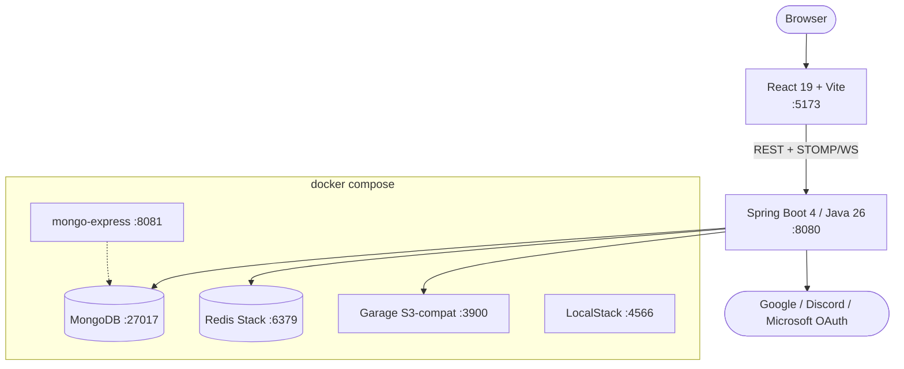

# Infrastructure

The local development stack: what runs where, and on which ports. Production
deployment is not designed yet — there is no AWS, queue, or worker
infrastructure in this repo.

## Local stack

The backend keeps durable aggregates in MongoDB, all volatile live-session state
plus auth sessions in Redis, and image objects in Garage. Media ingest and
storage are `media/storage/ImageIngestService` and
`media/storage/S3StorageService`; live play is the `session/` package. See
[Backend Service Map](../diagrams/backend-services.md).

## Docker Compose services

| Service | Image | Ports | Role |
| --- | --- | --- | --- |
| `mongodb` | `mongo:7.0` | 27017 | Primary database |
| `redis` | `redis/redis-stack-server` | 6379 | Sessions, cache, live-session state, pub/sub. `:8001` is mapped but nothing listens — the `-server` image ships no UI. |
| `garage` | `dxflrs/garage:v1.0.1` | 3900 / 3903 | Local S3-compatible object storage |
| `mongo-express` | `mongo-express:latest` | 8081 | MongoDB admin UI — [runbook](../runbooks/using-mongo-express.md) |
| `localstack` | `localstack/localstack:4` | 4566 | Local AWS emulation, scoped to `cloudwatch,logs` |

Spring does **not** auto-start these (`spring.docker.compose.enabled=false`) —
bring them up yourself. Startup, seeding and the rest of the everyday loop live
in the [Running the project](../runbooks/running-the-project.md) runbook;
credentials in [Environment Variables](environment-variables.md).

## Health & observability

The health surface is Spring Actuator's `/actuator/health` (the only Actuator
endpoint exposed, and the only permitted-unauthenticated one besides auth,
OAuth, swagger and `/ws`). There is no `/api/health`.

Everything else about logging and metrics — what is implemented (`MdcLoggingFilter`
`X-Request-Id`→`traceId`→`userId` correlation, the RFC 9457 error path, the
frontend logger) and what is deferred (structured JSON logging, Actuator metrics,
CloudWatch delivery, Sentry) — is owned by
[ADR 001 — Observability & logging stack](../decisions/001-observability-stack.md)
and the [observability runbook](../runbooks/using-the-observability-stack.md).
Don't restate it here.
