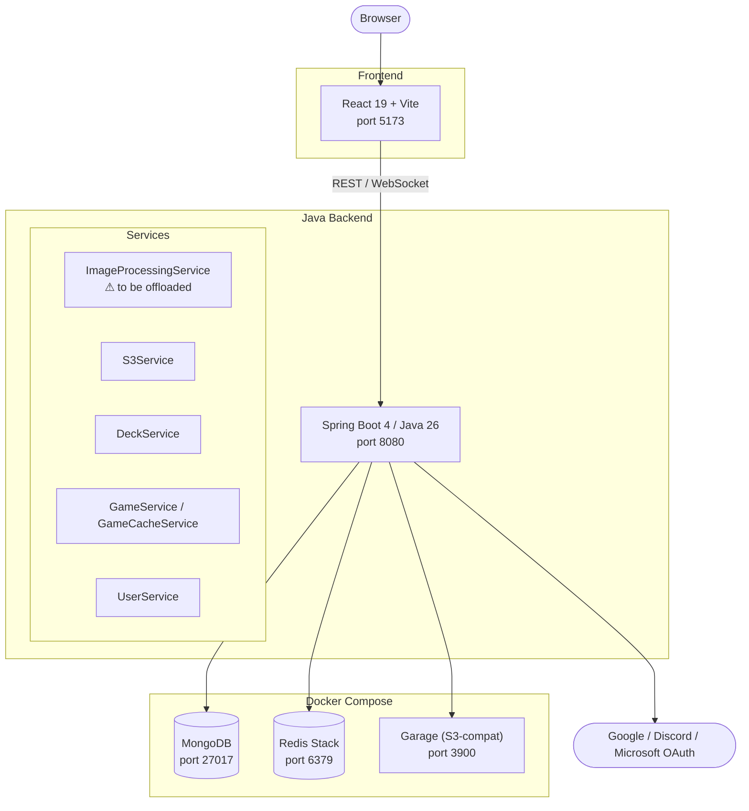
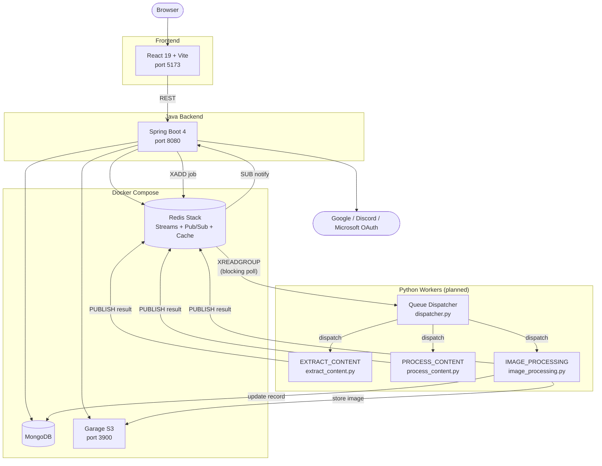
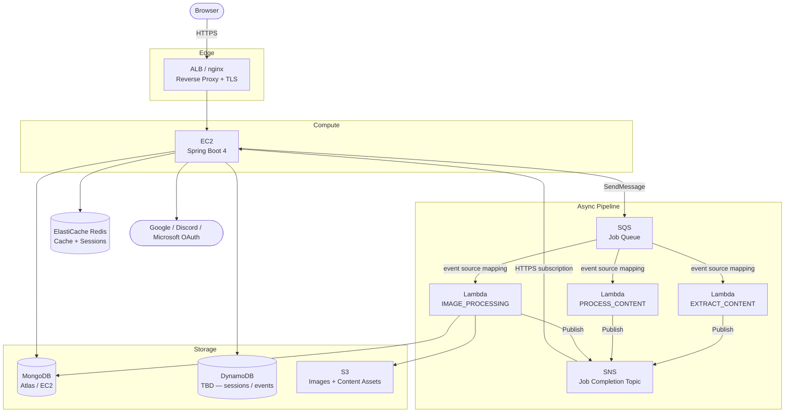

# Ambi — Infrastructure Guide

Describes the current local development stack and the planned AWS production architecture, including the async job pipeline that will offload compute-heavy work from the main Java application, the dead-letter queue strategy for failed jobs, database backup procedures, and the observability stack.

---

## Current Local Stack



### Docker Compose services

| Service         | Image                       | Ports       | Role                                              |
| --------------- | ---------------------------- | ----------- | -------------------------------------------------- |
| `mongodb`       | `mongo:7.0`                  | 27017       | Primary database                                   |
| `redis`         | `redis/redis-stack-server`   | 6379 / 8001 | Cache, sessions, (planned) job queue               |
| `garage`        | `dxflrs/garage:v1.0.1`       | 3900 / 3903 | Local S3-compatible object storage                 |
| `mongo-express` | `mongo-express:latest`       | 8081        | Web-based MongoDB admin UI                         |
| `localstack`    | `localstack/localstack:4`    | 4566        | Local AWS emulation, scoped to `cloudwatch,logs`   |

---

## Planned: Async Job Pipeline

Heavy or async work (content extraction, AI processing, image handling) will be offloaded from the Java app into a queue-driven pipeline of Lambda-style workers. Locally this is simulated with Redis primitives and Python functions. On AWS it maps directly to SQS + Lambda + SNS.

### Job types

| Job type           | Trigger                    | Worker        | Output                            |
| ------------------ | -------------------------- | ------------- | --------------------------------- |
| `EXTRACT_CONTENT`  | User submits content       | Python Lambda | Extracted text/metadata → queue   |
| `PROCESS_CONTENT`  | After extraction completes | Python Lambda | AI-processed result → DB / notify |
| `IMAGE_PROCESSING` | User uploads profile image | Python Lambda | Resized image → S3 + DB updated   |

`IMAGE_PROCESSING` is currently handled by `ImageProcessingService.java` — it will be the first service extracted out of the Java app.

### Local simulation (planned additions to Docker Compose)

| AWS service | Local simulation                        | How                                                            |
| ----------- | --------------------------------------- | -------------------------------------------------------------- |
| SQS         | Redis Streams (`XADD` / `XREADGROUP`)   | Durable, consumer-group-aware queue on existing Redis instance |
| SNS         | Redis Pub/Sub (`PUBLISH` / `SUBSCRIBE`) | Fan-out notifications back to the Java app on job completion   |
| Lambda      | Python worker functions                 | Invoked by the Queue Dispatcher process                        |

#### Queue Dispatcher

A Python worker process (`workers/dispatcher.py`) that bridges the queue and the Lambda handlers locally. On AWS this role is replaced by SQS event-source mappings that trigger Lambda directly.

```text
Loop:
  XREADGROUP from Redis Stream (blocking)
  → read job_type from message
  → route to EXTRACT_CONTENT | PROCESS_CONTENT | IMAGE_PROCESSING handler
  → handler runs, produces result
  → PUBLISH result to Redis Pub/Sub channel
  → XACK message
```

The Java app subscribes to the Pub/Sub channel to receive completion events (mirrors an SNS→HTTPS subscription on AWS).

### Local queue architecture (planned)



---

## Planned: Dead-Letter Queue (DLQ)

Jobs that fail after exhausting retries are moved to a dead-letter queue rather than being silently dropped. The DLQ preserves the original job payload, error details, and attempt history for inspection, manual replay, or alerting.

### Retry policy

| Attempt | Delay before retry |
| ------- | ------------------ |
| 1st     | 2 s                |
| 2nd     | 4 s                |
| 3rd     | 8 s                |
| → DLQ   | no further retry   |

Max retries: **3**. After the third failure the message is acknowledged out of the main queue and written to the DLQ.

### Local (Redis Streams)

Two streams and one hash are added to the existing Redis instance — no new infrastructure needed.

| Key                | Type   | Purpose                                      |
| ------------------ | ------ | -------------------------------------------- |
| `jobs:queue`       | Stream | Main job queue (already planned)             |
| `jobs:dlq`         | Stream | Dead letters — failed jobs after max retries |
| `jobs:retry_count` | Hash   | `msg_id → attempt_count`; cleared on success |

Updated dispatcher loop:

```text
Loop:
  XREADGROUP from jobs:queue (blocking)
  → route to handler by job_type
  → on success:
      PUBLISH result to Pub/Sub channel
      XACK message
      HDEL jobs:retry_count msg_id
  → on failure:
      retries = HINCRBY jobs:retry_count msg_id 1
      if retries < MAX_RETRIES:
          sleep(2 ^ retries) seconds          # exponential backoff
          XADD jobs:queue with original payload
          XACK (clear from PEL)
      else:
          XADD jobs:dlq {payload, error, timestamp, attempts}
          HDEL jobs:retry_count msg_id
          XACK (clear from PEL)
```

Inspect the DLQ locally: `XRANGE jobs:dlq - +`

### AWS (SQS)

SQS handles retries and DLQ routing natively via a **redrive policy** — no dispatcher code required.

- Set `maxReceiveCount: 3` on the source queue's redrive policy.
- Point the redrive target at a separate `ambi-jobs-dlq` queue.
- After 3 failed Lambda invocations SQS moves the message automatically.
- A CloudWatch alarm on `ApproximateNumberOfMessagesVisible` for the DLQ publishes to an SNS alert topic (email + Sentry; see Observability section).

| Local                      | AWS equivalent                                         |
| -------------------------- | ------------------------------------------------------ |
| `jobs:dlq` stream          | `ambi-jobs-dlq` SQS queue                              |
| Retry loop in dispatcher   | SQS `maxReceiveCount` + Lambda automatic retry         |
| `jobs:retry_count` hash    | SQS approximate receive count (tracked by the service) |
| Manual `XRANGE` inspection | SQS console / AWS CLI `receive-message` on DLQ         |

---

## Planned: AWS Production Architecture



### AWS service mapping

| Local                    | AWS Production             | Notes                                            |
| ------------------------ | -------------------------- | ------------------------------------------------ |
| Garage (S3-compat)       | AWS S3                     | Same SDK, switch endpoint URL                    |
| Redis Streams            | AWS SQS                    | Standard queue; FIFO queue for ordered jobs      |
| Redis Pub/Sub            | AWS SNS                    | Topic per job type; EC2 app subscribes via HTTPS |
| Python worker functions  | AWS Lambda (Python 3.x)    | Same handler code, swap out I/O bootstrapping    |
| Queue Dispatcher process | SQS event source mapping   | AWS manages polling; dispatcher not needed       |
| MongoDB (Docker)         | MongoDB Atlas or self-host | No code changes required                         |
| Redis (Docker)           | AWS ElastiCache (Redis)    | No code changes required                         |

---

## Worker directory layout (planned)

```text
ambi/
└── workers/
    ├── dispatcher.py          # Local-only; polls Redis Streams, routes to handlers
    ├── handlers/
    │   ├── extract_content.py # EXTRACT_CONTENT Lambda handler
    │   ├── process_content.py # PROCESS_CONTENT Lambda handler
    │   └── image_processing.py# IMAGE_PROCESSING Lambda handler
    ├── lib/
    │   ├── queue.py           # Shared queue client (Redis locally, boto3 SQS on AWS)
    │   └── retry.py           # Retry/backoff + DLQ routing (local only; SQS handles on AWS)
    └── requirements.txt
```

Each handler module exposes a `handler(event, context)` function matching the AWS Lambda interface so the same code runs locally (invoked by the dispatcher) and on AWS (invoked by the runtime) without modification.

---

## Environment parity

The `queue.py` abstraction layer reads `QUEUE_BACKEND=redis|sqs` from the environment and returns the appropriate client. This keeps handler code identical between local and production.

| Variable                    | Local value             | AWS value                           |
| --------------------------- | ----------------------- | ----------------------------------- |
| `QUEUE_BACKEND`             | `redis`                 | `sqs`                               |
| `REDIS_HOST`                | `localhost`             | ElastiCache endpoint                |
| `SQS_QUEUE_URL`             | _(unused locally)_      | `https://sqs.<region>...`           |
| `SQS_DLQ_URL`               | _(unused locally)_      | `https://sqs.<region>.../dlq`       |
| `SNS_TOPIC_ARN`             | _(unused locally)_      | `arn:aws:sns:...`                   |
| `S3_ENDPOINT`               | `http://localhost:3900` | _(omit; SDK uses default AWS)_      |
| `S3_BUCKET`                 | `ambi-images`            | `ambi-prod`                         |
| `SENTRY_DSN`                | `https://...@sentry.io` | same                                |
| `SENTRY_ENVIRONMENT`        | `local`                 | `production`                        |
| `SENTRY_TRACES_SAMPLE_RATE` | `1.0`                   | `0.1`                               |
| `JOB_MAX_RETRIES`           | `3`                     | `3` (mirrors SQS `maxReceiveCount`) |

---

## Planned: Database Backups

### Local

A shell script (`scripts/backup_mongo.sh`) dumps MongoDB, compresses the archive, and uploads it to the local Garage S3 bucket under a `backups/` prefix.

```bash
#!/usr/bin/env bash
# scripts/backup_mongo.sh
TIMESTAMP=$(date +%Y%m%d_%H%M%S)
DUMP_DIR=/tmp/mongodump_$TIMESTAMP

mongodump --uri="$MONGO_URI" --out="$DUMP_DIR"
tar czf /tmp/ambi_$TIMESTAMP.tar.gz -C /tmp "mongodump_$TIMESTAMP"

aws --endpoint-url "$S3_ENDPOINT" s3 cp \
  /tmp/ambi_$TIMESTAMP.tar.gz \
  s3://$S3_BUCKET/backups/daily/ambi_$TIMESTAMP.tar.gz

rm -rf "$DUMP_DIR" /tmp/ambi_$TIMESTAMP.tar.gz
```

Run manually or via cron:

```bash
# Daily at 02:00
0 2 * * * /path/to/scripts/backup_mongo.sh
```

### AWS

| Deployment          | Strategy                                                                                         |
| ------------------- | ------------------------------------------------------------------------------------------------ |
| **MongoDB Atlas**   | Enable continuous cloud backup in the Atlas console; point-in-time recovery is built in          |
| **Self-hosted EC2** | Schedule `backup_mongo.sh` as an EventBridge cron → Lambda; store dumps in a versioned S3 bucket |

**Retention policy (S3 lifecycle rules):**

| Prefix             | Frequency | Retain for |
| ------------------ | --------- | ---------- |
| `backups/daily/`   | Daily     | 7 days     |
| `backups/weekly/`  | Weekly    | 28 days    |
| `backups/monthly/` | Monthly   | 90 days    |

Weekly and monthly archives are produced by the same script; a day-of-week / day-of-month check in the script (or separate cron entries) routes the file to the correct prefix.

---

## Observability

The backbone and its rationale are recorded in [ADR 001 — Observability & logging stack](../decisions/001-observability-stack.md): a **hybrid** of CloudWatch (logs + metrics, via the container log driver) and Sentry (errors + frontend Web Vitals/replay), with **LocalStack** providing local CloudWatch parity. Part of the vendor-agnostic foundation is implemented today — `X-Request-Id`→`traceId`→`userId` correlation (`MdcLoggingFilter`) and the frontend logger + error boundary; **structured JSON logging and Actuator metrics/info exposure are still planned**, not yet wired up. The **Sentry/X-Ray vendor wiring is deferred** until needed, behind clearly-marked seams.

### Error tracking — Sentry _(deferred vendor phase)_

Sentry is the chosen error-tracking vendor across all three layers, wired later via the seams left in `logger.ts` (frontend) and `pom.xml` (backend). All layers share the same Sentry org; use separate DSNs per project (frontend / backend / workers) for clean grouping. Backend error→HTTP mapping already lives in the [exception system](../features/exceptions.md) and stamps the shared `traceId`, so Sentry slots in alongside it.

| Layer               | SDK / integration            | What it captures                                                   |
| ------------------- | ---------------------------- | ------------------------------------------------------------------ |
| React frontend      | `@sentry/react`              | Unhandled exceptions, error boundaries, Web Vitals, session replay |
| Spring Boot backend | `sentry-spring-boot-starter` | Unhandled exceptions, slow transactions, HTTP request data         |
| Python workers      | `sentry-sdk`                 | Handler exceptions; tags: `job_type`, `job_id`, `attempt`          |

**Tags to set on every Sentry event:**

| Tag           | Values                                                                      |
| ------------- | --------------------------------------------------------------------------- |
| `environment` | `local` \| `production`                                                     |
| `job_type`    | `EXTRACT_CONTENT` \| `PROCESS_CONTENT` \| `IMAGE_PROCESSING` (workers only) |
| `user_id`     | Session user ID (backend + frontend; omit for guests)                       |

**DLQ → Sentry alert:** when a message lands in the DLQ (locally: a monitor process tails `jobs:dlq`; on AWS: CloudWatch alarm on DLQ depth → Lambda → Sentry `capture_message`), a Sentry issue is raised with the full job payload attached.

### Structured logging _(planned)_ / correlation _(implemented)_

**Correlation is implemented today.** `MdcLoggingFilter` puts `traceId` and
`userId` into the SLF4J MDC for every request: the frontend stamps each
request with an `X-Request-Id` (`emptyApi.ts`), the filter adopts it as the
MDC `traceId` (minting one if absent) and adds `userId` (the authenticated
principal name), then echoes the id back on the response. The same `traceId`
is stamped into RFC 9457 `ProblemDetail` error bodies by
`GlobalExceptionHandler` (the single `@RestControllerAdvice`), so a client-side
id ties directly to the matching server log lines.

**Structured JSON output is planned, not yet implemented.** The target is for
the `prod` Spring profile to emit one-line JSON via Logback +
`logstash-logback-encoder` (`logback-spring.xml`), with the default/local
profile keeping the readable console. Today there is no `logback-spring.xml`
in the repo and no `logging.*` configuration at all — every profile runs on
Spring Boot's default (unstructured) console output. The
`logstash-logback-encoder` dependency is already in `backend/pom.xml`, but
nothing wires it up yet. Example of the target record shape once implemented:

```json
{
  "timestamp": "2026-05-08T02:00:00Z",
  "level": "ERROR",
  "logger": "cephadex.ambi.service.UserService",
  "message": "...",
  "traceId": "abc123",
  "userId": "6641f2..."
}
```

Python workers use `structlog` (or stdlib `logging` with a JSON formatter). Every log record includes `job_id`, `job_type`, and `attempt`.

Logs always go to **stdout**; the app makes no CloudWatch API calls itself. On AWS the container log driver (awslogs on ECS / CloudWatch agent on EC2) would ship stdout to CloudWatch Logs, queried with CloudWatch Logs Insights. Locally, the `localstack` container (`compose.yaml`, scoped to `cloudwatch,logs`) lets that path be exercised in dev; Actuator metrics feeding `micrometer-registry-cloudwatch2` in prod is planned — neither the metrics/info exposure config nor the `micrometer-registry-cloudwatch2` dependency exist yet (only the `health` endpoint is exposed today).

### Health endpoint

The existing `/api/health` endpoint checks MongoDB and Redis connectivity. Extend it to include:

- `jobs:queue` depth (`XLEN jobs:queue`) — surface queue backlog as a readiness signal
- `jobs:dlq` depth (`XLEN jobs:dlq`) — non-zero value indicates jobs needing attention

### AWS-specific signals

| Signal                        | Service                                          |
| ----------------------------- | ------------------------------------------------ |
| Application errors            | Sentry                                           |
| Infrastructure metrics        | CloudWatch (CPU, memory, SQS queue depth)        |
| DLQ depth alarm               | CloudWatch Alarm → SNS → email + Sentry alert    |
| Log aggregation               | CloudWatch Logs Insights                         |
| Uptime / synthetic checks     | CloudWatch Synthetics or UptimeRobot             |
| Distributed traces (optional) | AWS X-Ray via OpenTelemetry auto-instrumentation |
