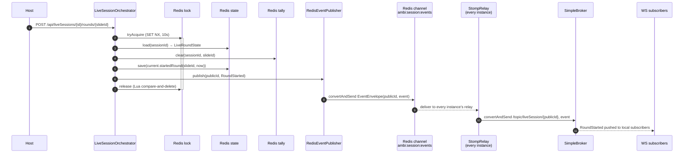

# Live Session Backend Flow

Flow of a live session through the backend, focused on the Redis stores, the
event/notification path, and WebSocket delivery.

The orchestrator never touches transport — it reads/writes Redis (volatile live
state) and Mongo (durable aggregate), then publishes a `SessionEvent` through
`EventPublisher`. Events fan out over a single Redis pub/sub channel; each
instance's relay re-emits them to the local STOMP broker.

## Architecture flow

```mermaid
flowchart TB
    subgraph clients["Clients (Host + Participants)"]
        REST["REST commands<br/>(start · join · openRound<br/>· submit · reveal · end)"]
        WS["WebSocket subscribers<br/>SUB /topic/liveSession/{publicId}"]
    end

    subgraph app["Backend instance(s)"]
        ORCH["LiveSessionOrchestrator<br/>every transition:<br/>1. withLock → 2. R/W Redis<br/>3. R/W Mongo → 4. publish event"]
        PUB["EventPublisher → RedisEventPublisher<br/>serialize EventEnvelope(publicId, event)"]
        RELAY["LiveSessionStompRelay<br/>(MessageListener on every instance)"]
        BROKER["Spring SimpleBroker<br/>/topic/liveSession/{publicId}<br/>(in-memory, local subs only)"]
    end

    subgraph mongo["MongoDB (durable)"]
        LS[("LiveSessions<br/>status · roster · deck snapshot")]
        PART[("participants")]
        ANS[("answers")]
        RR[("round_results")]
    end

    subgraph redis["Redis (volatile live state)"]
        LOCK[["lock<br/>SET NX + Lua release · 10s"]]
        STATE[["state — LiveRoundState<br/>phase · currentSlideId · startedAt · 6h"]]
        TALLY[["tally — HINCRBY per option · 6h"]]
        ANSW[["answers — HSET by participantId · 6h"]]
        PRES[["presence — HSET by participantId · 6h"]]
        CHAN(("pub/sub channel<br/>ambi:session:events"))
    end

    REST -->|host/participant action| ORCH

    ORCH -->|withLock| LOCK
    ORCH -->|load/save| STATE
    ORCH -->|increment/clear| TALLY
    ORCH -->|submit/clear| ANSW
    ORCH -->|save/remove/clear| PRES
    ORCH -->|persist lifecycle/roster| LS
    ORCH --> PART
    ORCH -->|flush answers on close| ANS
    ORCH -->|persist scored RoundResult| RR

    ORCH -->|publish event| PUB
    PUB -->|convertAndSend JSON| CHAN
    CHAN -->|fan-out to ALL instances| RELAY
    RELAY -->|convertAndSend<br/>/topic/liveSession/{publicId}| BROKER
    BROKER -->|push event| WS

    WS -. SUBSCRIBE frame .-> AUTH["SubscribeAuthInterceptor<br/>authenticated · not VISITOR"]
```

## Event publish sequence (e.g. `startRound`)



## Notes

- **Two stores, two jobs.** Mongo holds the durable aggregate (lifecycle, roster,
  deck snapshot); Redis holds all volatile live state (round phase, tallies,
  answers, presence) on 6h TTLs, with a 10s lock lease.
- **Orchestrator never touches transport.** It only calls
  `EventPublisher.publish(publicId, event)`. The `publicId` rides on
  `LiveRoundState`, so a locked transition already has the topic handle without an
  extra Mongo read.
- **One Redis channel, relay-side routing.** `RedisEventPublisher` writes every event
  to the single `ambi:session:events` channel; every instance's
  `LiveSessionStompRelay` receives it and re-emits to `/topic/liveSession/{publicId}`
  on its **local** SimpleBroker. That's the multi-instance fan-out, with no
  self-skip/dedup needed.
- **`submitAnswer` is the lock-free path.** A single `HSET` (answer) + `HINCRBY`
  (tally) + `TallyUpdated`, deliberately not going through `withLock`.
